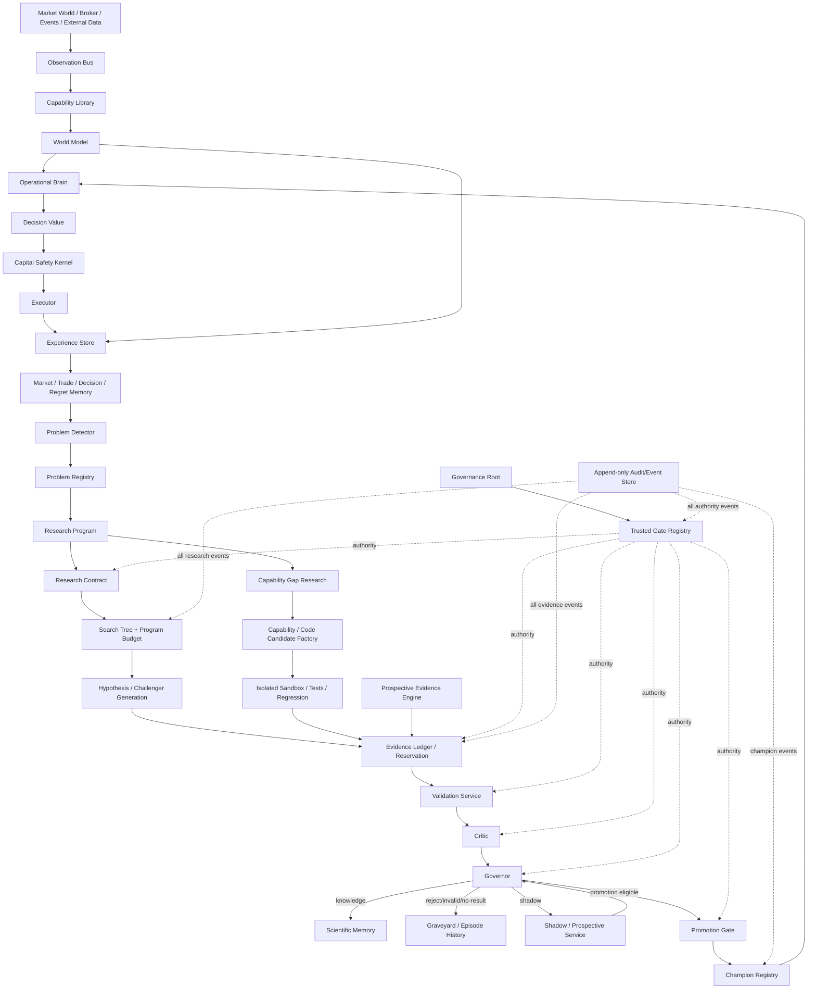
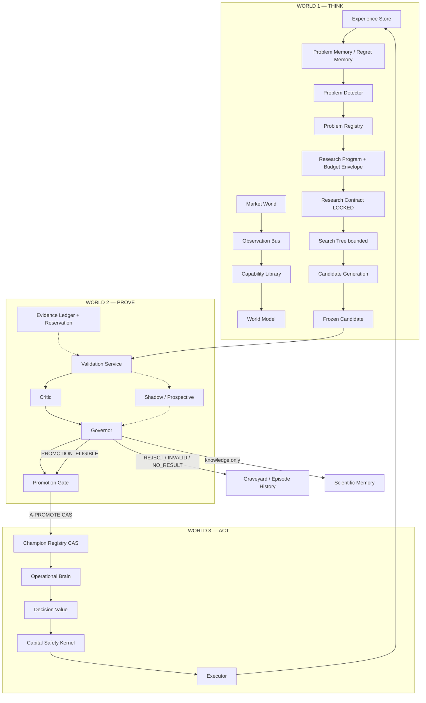

# AHFMES AUTONOMOUS RESEARCH ENGINE (ARE) — GRAND DESIGN V1

**Status:** KONSOLIDASI ORIENTASI / NON-NORMATIF / ZERO AUTHORITY  
**Tanggal konsolidasi:** 2026-08-26  
**Catatan supersedence:** total regresi permanen kini **369**
(R7=26, R8=40, R9=X001..X303) per Correction V34 / Protocol V36; angka 365
pada dokumen ini adalah snapshot historis. Otoritas current =
Manifest V36 (namespace S1 `ARE0/*`). Detail: `PROJECT_GOVERNANCE/ARE0/GRAND_DESIGN/AHFMES_ARE_0_INTEGRATED_WAVE_DESIGN_S1.md`.  
**Sumber:** Konsolidasi setia dari `PROJECT_GOVERNANCE` repo ini (228 file), terutama:

```text
AHFMES_ARE_FORMAL_ARCHITECTURE_MASTER_V2.md            (peta terintegrasi)
AHFMES_AUTONOMOUS_RESEARCH_ENGINE_ARCHITECTURE_V0.md   (direksi arsitektur)
AHFMES_AUTONOMOUS_RESEARCH_ENGINE_CONSTITUTION_V0.md   (konstitusi ilmiah)
AHFMES_AUTONOMOUS_RESEARCH_ENGINE_OBJECT_MODEL_V0.md   (model objek)
AHFMES_AUTONOMOUS_RESEARCH_ENGINE_FLOWCHARTS_V0.md     (flowchart human-readable)
AHFMES_ARE_0A_STATE_MACHINES_AND_INVARIANTS_V3.md      (state machine normatif)
AHFMES_ARE_0B_AUTHORITY_NON_FORGEABILITY_V3.md         (otoritas normatif)
AHFMES_ARE_0C_EVIDENCE_LEDGER_AND_HOLDOUT_CONSUMPTION_V2.md
AHFMES_ARE_0D_SEARCH_GENEALOGY_BUDGET_MULTIPLICITY_V2.md
AHFMES_ARE_0E_CRITIC_GOVERNOR_PROMOTION_V2.md
AHFMES_ARE_0F_INTERNAL_THREE_ROLE_ADVERSARIAL_REVIEW_V1.md
+ dokumen workflow, kualifikasi, dan jurnal pendukung
```

> Dokumen ini TIDAK menggantikan dokumen normatif. Otoritas tetap pada
> closed-set Manifest V36 (men-supersede V35). Jika ada konflik, dokumen normatif yang menang.
> Dokumen ini tidak mengotorisasi implementasi apa pun.

---

# BAGIAN I — IDENTITAS DAN TUJUAN

## Bab 1. Apa itu ARE

ARE (Autonomous Research Engine) adalah rancangan **sistem riset pasar
otonom berbasis disiplin ilmiah keras** untuk AHFMES — sistem mikro-eksekusi
XAUUSD. Tujuannya bukan membuat bot lebih pintar mencari strategi, melainkan
membuat sistem yang mampu:

1. mendeteksi masalah ekonomi yang bermakna;
2. membentuk hipotesis terbatas (bounded);
3. mencari jawaban dalam budget terbatas;
4. menolak ide palsu secara permanen;
5. mengingat semua bukti yang sudah dikonsumsi;
6. mengusulkan keturunan evolusioner yang sah;
7. tanpa pernah memalsukan otoritas ilmiah atau modal.

Prinsip inti (kutipan langsung dari Architecture V0):

> **"Do not limit what AHFMES may think about. Limit what may be treated as
> proven and what may touch capital."**

Kebebasan berpikir itu luas; pembuktian dan otoritas modal itu sempit.

## Bab 2. Konteks sejarah: kenapa ARE lahir

Alur kronologis (dari CURRENT_AUTHORITY_INDEX dan jurnal):

```text
AHFMES v3.x (bot operasional paper trading XAUUSD)
        ↓
Condition Atlas V1 (eksplorasi habitat)
        ↓
Position Path Replay V1 — eksperimen W1 G1:
   hipotesis "setelah +$1, proteksi break-even"
   hasil = PPR_W1_G1_REJECT (G1 GAGAL secara sah)
        ↓
P001 "PROFIT GIVEBACK" dipertahankan sebagai UNRESOLVED
   (dilarang retune G1, dilarang rescue G2)
        ↓
2026-08-20: keputusan arah — bangun mesin riset otonom,
   bukan tuning manual aturan entry/exit
        ↓
Formalisasi ARE-0 (kontrak formal) + audit adversarial berlapis
        ↓
Repositori AHFMES-ARE = ekstraksi byte-identical seluruh dokumen ARE
```

Pelajaran kunci dari G1: state biner "pernah +$1" + "kembali ~0" tidak cukup
robust. Pertanyaan terbuka P001: *apakah informasi yang lebih kaya SEBELUM
keputusan exit mengandung nilai inkremental stabil untuk EXIT vs CONTINUE?*
Jawabannya sengaja dibiarkan UNKNOWN — menjadi testcase sah pertama ARE.

## Bab 3. DNA arsitektur

DNA yang wajib dijaga (Constitution V0):

```text
EVIDENCE-FIRST
MICRO-EXECUTION ORIENTED
ADAPTIVE
PATH / STATE AWARE
UNCERTAINTY-AWARE
COUNTERFACTUAL / DECISION-VALUE AWARE
AUDITABLE
FAIL-CLOSED
SURVIVAL-CONSTRAINED
```

Catatan penting:
- `HIGH OPPORTUNITY DENSITY` adalah preferensi kondisional berbasis evidence,
  BUKAN kuota. Frekuensi tidak boleh mengalahkan kualitas bukti.
- Information horizon ≠ holding horizon: D1/H4/H1/news adalah sensor konteks;
  M5/M1/TICK adalah sensor taktikal/eksekusi. Kapabilitas baru hanya aktif
  setelah nilai inkrementalnya TERBUKTI.
- Contoh drift DNA yang dilarang: sinyal H4 → hold 36 jam → target swing besar
  (itu sistem ekonomi lain, butuh re-charter terpisah).

---

# BAGIAN II — KONSTITUSI

## Bab 4. Scientific Constitution (aturan keras)

| ID | Aturan | Inti |
|---|---|---|
| SC-01 | Discovery is not validation | Bukti penemu hipotesis tak boleh jadi bukti validasinya |
| SC-02 | No self-acceptance | Proses pencipta kandidat tak boleh promosi sendiri |
| SC-03 | Information-time provenance | Klaim hanya boleh pakai info tersedia pada timestamp keputusan |
| SC-04 | Precommit the estimand | Populasi/metrik/budget/stopping rule dibekukan sebelum validasi |
| SC-05 | Full multiplicity accounting | Multiplexitas dihitung pada SELURUH genealogi pencarian |
| SC-06 | Research budget is finite | Tak boleh cari sampai PASS; habis budget = NO_EDGE_FOUND sah |
| SC-07 | Holdout evidence is consumable | Paparan berulang mengurangi independensi holdout |
| SC-08 | Rejected evidence is immutable | Hipotesis ditolak tak bisa direlabel/diretune/dihapus |
| SC-09 | Candidate immutability during proof | Kandidat beku saat validasi/shadow |
| SC-10 | No rescue within same experiment | Kegagalan tak boleh ditolong ganti threshold/metric/populasi |
| SC-11 | INVALID ≠ REJECT | REJECT = eksperimen sah tapi gagal; INVALID = integritas rusak |
| SC-12 | No-result states are legitimate | NO_STABLE_EDGE, NON_PREDICTABLE dll adalah outcome sah |
| SC-13 | Capability-gap is a hypothesis | Gagal ≠ otomatis butuh sensor/data baru |
| SC-14 | Comparative promotion | Promosi = nilai inkremental mengganti champion, bukan profit solo |
| SC-15 | Fail closed | Provenance/otoritas meragukan → tidak promosi, tidak trading |

## Bab 5. Capital Safety Kernel (CSK)

Kernel keselamatan modal BUKAN keluarga strategi. Domain terlindungi minimum:

```text
catastrophic loss bound    maximum exposure       position/order sanity
broker connectivity sanity market-data sanity     clock/provenance sanity
execution limits           emergency flat         kill switch
production authority       rollback
```

Aturan:
- **CSK-01**: Research Brain tak boleh melemahkan batas survival demi EV historis.
- **CSK-02**: Strategi terpromosi tetap tunduk pada Kernel.
- **CSK-03**: Kernel boleh veto trade/kandidat apapun confidence Research Brain.
- **CSK-04**: Kontrol emergency harus callable eksternal/independen.
- **CSK-05**: Kandidat kode yang mengubah perilaku safety butuh otoritas
  governance terpisah, bukan promosi strategi biasa.

Asimetri penting: emergency-flat boleh MENGURANGI risiko tanpa siklus riset,
tapi tidak boleh MENCIPTAKAN edge atau mempromosikan apa pun.

---

# BAGIAN III — ARSITEKTUR

## Bab 6. Hukum otoritas fundamental

```text
THINK -> PROVE -> ACT     (satu-satunya alur legal)
THINK -----------------> ACT   (TERLARANG, langsung maupun tidak langsung)
```

Tidak ada objek milik riset — model, kandidat kode, output LLM, field status,
laporan — yang dapat menciptakan otoritas modal. Data/klaim object ≠ verified
authority capability.

### Trust worlds

```text
WORLD 1 THINK : Research Brain, prioritisasi problem, generasi kandidat,
                riset capability-gap
WORLD 2 PROVE : Contract Gate, Evidence Ledger, Validation Service, Critic,
                Governor, Promotion Gate
WORLD 3 ACT   : Champion Registry, Operational Brain, Capital Safety, Executor
```

Pemisahan ini adalah pemisahan otoritas MEKANIS, bukan sekadar nama class
berbeda — bahkan dalam satu PC fisik.

## Bab 7. Peta arsitektur menyeluruh



## Bab 8. Fast loop dan slow loop

### Fast loop — kecerdasan pasar (cepat, live)

```text
input arrives -> as-of normalize -> update world state
-> retrieve memory/model -> compute bounded decision value
-> select action -> Capital Safety -> execute/abstain
-> record exact experience
```

Fast loop hanya mengadaptasi estimasi state saat ini. Ia TIDAK boleh
menyunting struktur policy produksi secara in-place.

### Slow loop — evolusi ilmiah (lambat, proof-gated)

```text
experience -> regret/anomaly/problem -> immutable Research Episode
-> Research Program + Program Budget Envelope -> locked Research Contract
-> bounded discovery -> Search Tree -> frozen challenger
-> Evidence Reservation -> validation -> Critic -> Governor
-> knowledge/reject/no-result/shadow -> promotion eligibility
-> exact champion comparison -> atomic promotion
```

Aturan adaptasi:
- State adaptation (cepat/live): volatilitas, regime probability, spread
  hostility, confidence, similarity, trade-health.
- Policy adaptation (lambat/proof-gated): rule exit baru, threshold family
  baru, arsitektur model baru, kombinasi fitur baru, timeframe konteks baru,
  sumber data baru, code capability baru — semuanya wajib lewat lifecycle
  ilmiah penuh.

---

# BAGIAN IV — MODEL OBJEK DAN SIKLUS HIDUP

## Bab 9. Registries inti

### Problem (persisten)
Identitas fenomena/pertanyaan, BUKAN satu hasil eksperimen. Lifecycle:
`OBSERVED -> OPEN -> DORMANT <-> OPEN -> RETIRED`.
Problem TIDAK memegang satu disposition terminal mutable — riwayat ilmiahnya
hidup di Research Episodes.

### Research Episode (immutable)
Setiap investigasi bounded dari sebuah Problem = episode immutable.
Lifecycle: `PLANNED -> CONTRACTED -> RESEARCHING -> ADJUDICATED`.
Disposition episode (immutable setelah ADJUDICATED):

```text
NO_RESULT | UNRESOLVED | CURRENTLY_NON_PREDICTABLE | INSUFFICIENT_SAMPLE
INSUFFICIENT_OBSERVABILITY | NO_STABLE_EDGE | RESOLVED_BOUNDED
REJECTED | INVALID | VALIDATED_BOUNDED | PROMOTION_ELIGIBLE
```

```text
Problem P001
├─ Episode E1 = REJECTED        (tak pernah ditulis ulang)
├─ Episode E2 = NO_STABLE_EDGE
└─ Episode E3 = VALIDATED_BOUNDED
```
Ringkasan "pemahaman saat ini" hanyalah derived view, bukan otoritas.

### Hypothesis
`PROPOSED -> CONTRACTED -> DISCOVERY_ACTIVE -> DISCOVERY_CLOSED ->
VALIDATION_READY -> VALIDATION_ACTIVE -> VALIDATION_CLOSED ->
SHADOW_READY -> SHADOW_ACTIVE -> SHADOW_CLOSED -> ADJUDICATED`.
Tanpa reverse edge. Rejected = immutable; perubahan material = ID turunan baru.

### Research Contract
Membekukan pertanyaan terbatas SEBELUM pencarian:
pertanyaan, populasi primer/validasi/discovery, primary estimand, ruang
pencarian, budget, multiplicity plan, stopping rule, peran Critic/Governor,
informasi terlarang. Setelah LOCKED: mutasi material → INVALID atau kontrak
keturunan (descendant) yang mewarisi debt keluarga — bukan reset budget.

### Experiment
Satu eksekusi terikat satu contract locked + kandidat immutable. Dimensi
ortogonal: lifecycle / integrity (NOT_CHECKED|PASS|INVALID) / hasil ilmiah
(NONE|NO_RESULT|REJECTED|VALIDATED_BOUNDED|PROMOTION_ELIGIBLE).
Integrity PASS ≠ sukses ilmiah.

### Candidate / Challenger
Objek riset immutable: POLICY | MODEL | CAPABILITY | CODE.
`DRAFT -> DISCOVERY_CANDIDATE -> FROZEN -> VALIDATION_READY -> ... ->
SHADOW_CLOSED -> ADJUDICATED -> RETIRED`.
Di FROZEN, closure konten transitif (semua dependensi material by hash)
immutable. Mutasi = descendant. Promosi BUKAN lifecycle edge — hanya
`PROMOTED_REFERENCE` mirror dari transaksi Champion Registry yang sudah
selesai.

### Capability
SENSOR | DATA_SOURCE | FEATURE_EXTRACTOR | MODEL_CLASS | POLICY_OPERATOR |
EXECUTION_PRIMITIVE | RESEARCH_TOOL. Problem yang unresolved TIDAK boleh
langsung masuk `GAP_HYPOTHESIS`; harus didukung Research Episode capability-gap
tersendiri.

### Graveyard / Rejected Registry
Mencegah rediscovery dan kebangkitan post-hoc ide gagal. Retry dilarang
kecuali hipotesis materially berbeda + otoritas baru.

## Bab 10. Invarian global (G01–G25)

```text
G01 identitas immutable setelah freeze          G14 descendant tak pernah menulis ulang parent
G02 ancestry immutable/append-only              G15 mutasi fase-proof = descendant atau INVALID
G03 disposition terminal immutable per episode  G16 Riset tak bisa self-validate/self-promote
G04 INVALID ≠ REJECTED                          G17 Critic tak bisa rescue/promote
G05 integrity PASS ≠ sukses ilmiah              G18 ID baru tidak reset debt/exposure
G06 archival ≠ disposition ilmiah               G19 transisi konkuren wajib CAS revisi eksak
G07 retention tak menghapus debt/provenance     G20 otoritas stale tak bisa mentransisi state
G08 VALIDATED_BOUNDED knowledge-only = legal    G21 kanonikal right = predicate lintas-objek
G09 setiap transisi harus legal eksplisit       G22 integritas/hasil/lifecycle eksperimen terpisah
G10 transisi tak dispesifikasi = ditolak        G23 provenance/origin/exposure/eligibility terpisah
G11 transisi butuh otoritas terverifikasi       G24 riwayat Problem = urutan Episode immutable
G12 field caller deskriptif saja                G25 jawaban P001 tak boleh diproduksi formalisasi
G13 descendant mewarisi debt pencarian/evidence
```

Retensi universal: `ACTIVE_RECORD | ARCHIVED_RECORD`. Archive TIDAK PERNAH
mengubah disposition/integrity/exposure/debt/genealogy. Tombstone dilarang
dari lifecycle ilmiah normal.

Konkurensi: semua stream authority-sensitive memakai revisi monotonik +
previous-event-hash + compare-and-append atomik. Tidak ada last-writer-wins.
Partial failure: state kanonikal TIDAK maju kecuali transaksi committed
terbukti.

---

# BAGIAN V — OTORITAS DAN NON-FORGEABILITY

## Bab 11. Kelas otoritas dan separation of duty

Kelas otoritas (non-interchangeable):

```text
A-CREATE, A-CONTRACT-DRAFT, A-LOCK, A-DISCOVERY, A-EVIDENCE-RESERVE,
A-EVIDENCE-RELEASE, A-VALIDATE, A-SHADOW, A-CRITIC, A-GOVERN, A-PROMOTE,
A-ROLLBACK, A-CAPABILITY, A-CAPITAL-ACTIVATE, A-EMERGENCY-FLAT
(+ A-CAPITAL-DEACTIVATE, A-AUTHORITY-REVOKE dst di Matrix)
```

Trust domains: TD-RESEARCH, TD-CONTRACT, TD-EVIDENCE, TD-VALIDATION,
TD-CRITIC, TD-GOVERNOR, TD-PROMOTION, TD-CAPITAL-SAFETY,
TD-CHAMPION-REGISTRY, TD-EXECUTION, TD-AUDIT, TD-GOVERNANCE-ROOT.

Untuk satu episode keputusan, principal yang sama DILARANG menggabungkan:

```text
DISCOVERY+VALIDATE | DISCOVERY+CRITIC | DISCOVERY+GOVERN | DISCOVERY+PROMOTE
VALIDATE+CRITIC    | VALIDATE+GOVERN   | VALIDATE+PROMOTE
CRITIC+GOVERN      | CRITIC+PROMOTE    | GOVERN+PROMOTE
PROMOTE+CAPITAL-ACTIVATE | PROMOTE+kekuatan mutasi broker
```

Ko-lokasi proses fisik ≠ runtuhnya izin: proses yang meng-host banyak service
tetap wajib mengekspos principal/capability berbeda.

## Bab 12. Root of trust

Rantai bootstrap:

```text
Governance Root Manifest (di luar jangkauan riset; perubahan = operasi
  governance eksplisit oleh HUMAN/GOVERNANCE EXTERNAL TO ARE RESEARCH)
  → Trusted Gate Registry (content-addressed, revocable, generation N)
    → Principal Role Manifest (content-addressed, tak bisa diedit riset)
      → Verified Authority Record (VAR) — binding eksak
        → Verify-at-use → Atomic transaction
```

Nama ramah seperti `GATE-V1` bukan otoritas tanpa verifikasi root eksak.
Threat model mengasumsikan kode riset bisa compromised/buggy; yang WAJIB
dijamin: kode milik Research tidak memiliki root Governance/authority store/
Capital Safety.

## Bab 13. Identitas konten kanonikal

- Encoding kanonikal `AHFMES_CANONICAL_OBJECT_V1`: UTF-8 NFC, key map urut
  leksikografis, integer desimal kanonikal, float biner dilarang di identitas,
  timestamp UTC RFC3339-Z, NaN/Infinity dilarang.
- Hash domain-separated: `SHA256("AHFMES:" || domain_tag || ":V1\n" || bytes)`
  dengan tag eksplisit per tipe (CANDIDATE_ROOT, EVIDENCE_SNAPSHOT, dst).
- Closure konten transitif pada boundary proof: seluruh dependensi material
  diikat by content hash. Pointer mutable (`current.pkl`, `latest.json`,
  branch HEAD) DILARANG di belakang otoritas beku.

## Bab 14. Freshness dan transaksi otoritas

Otoritas diverifikasi saat penerbitan DAN saat pemakaian. Perubahan konteks
dinamis yang terikat → otoritas belum terpakai menjadi stale:

```text
Evidence Ledger exposure berubah -> A-VALIDATE lama stale
search debt bertambah           -> proof validasi/promosi stale
candidate root berubah          -> otoritas tak applicable
champion berganti               -> A-PROMOTE lama stale
Safety kernel berubah           -> promosi/aktivasi lama stale
```

Transaksi single-use: verifikasi rantai → verifikasi nonce UNUSED → satu
transaksi atomik {nonce→CONSUMED, event→APPENDED, revisi→ADVANCED}.
Partial success dilarang; crash recovery menganggap transisi not-committed
kecuali commit record membuktikan semua efek.

Promosi champion = compare-and-swap: champion root eksak + generation +
previous-event-hash + nonce. Promosi A→B dan A→C konkuren: maksimal satu sukses.

Pemisahan akhir: `PROMOTE` (pemilihan deployment ilmiah) ≠ `CAPITAL-ACTIVATE`
(mutasi broker). A-PROMOTE tidak bisa mengirim order broker.

---

# BAGIAN VI — EVIDENCE LEDGER

## Bab 7'. Teorema inti

```text
INDEPENDENSI EVIDENCE ADALAH RELASI, BUKAN LABEL DATASET
```

Dievaluasi atas: snapshot, claim family, research family, program, role,
revisi ledger, riwayat disclosure.

## Bab 15. Snapshot dan dimensi ortogonal

Snapshot content-addressed immutable (data baru = snapshot baru).
Dimensi evidence terpisah total:
- Provenance: UNVERIFIED | VERIFIED | INVALID
- Origin: HISTORICAL_DISCOVERY | HISTORICAL_RESERVED | PROSPECTIVE_* |
  SHADOW_LIVE | EXTERNAL_EVENT | SYNTHETIC_DIAGNOSTIC
- Exposure: event append-only (aktor termasuk manusia/auditor/LLM yang
  pengetahuannya bisa mempengaruhi riset lanjutan)
- Eligibility: derived predicate — bukan field caller
- Retention: ACTIVE_RECORD | ARCHIVED_RECORD

Role evidence spesifik-kontrak: DISCOVERY | INTERNAL_VALIDATION |
INDEPENDENT_CONFIRMATION | PROSPECTIVE_CONFIRMATION | SHADOW_EVALUATION |
DIAGNOSTIC_ONLY.

## Bab 16. Relation gate dan kontaminasi

Relasi claim/research family mengikuti ancestry kausal. Aturan ketidakpastian:

```text
RELATED unless relation gate independen membuktikan UNRELATED_SUPPORTED
TD-RESEARCH tidak berwenang menerbitkan UNRELATED
```

RelationRegistry: satu slot relasi kanonikal per RELATION_KEY; alternatif
precommitted yang berkonflik fail-closed. Graf kontaminasi:

```text
Exposure -> Knowledge gained -> Motivation edge
-> Hypothesis/candidate/problem baru -> Descendant lineage
```

Manusia/auditor yang melihat hasil validasi lalu mengusulkan kandidat =
kontaminasi sama seperti agen otomatis. Ambigu motivasi → MOTIVATED_BY_EXPOSURE.

## Bab 17. Reservation, exposure class, holdout

Validation Reservation (atomik, sebelum akses outcome): snapshot eksak,
batch kandidat, klaim/metrik/populasi, multiplicity plan, disclosure scope,
ledger revision. Insertion kandidat hasil-driven = dilarang.

Exposure class:
```text
E0 metadata only
E1 precommitted bounded outcome result
E2 expanded aggregate outcomes
E3 row/raw outcome access
```

Aturan konsumsi holdout: **tanpa angka N universal**. Disclosure pertama yang
outcome-aware mengonsumsi independensi bagi descendant adaptif yang relevan
pada lineage tsb — kecuali sequential/batch plan precommitted sudah
mencakupnya. Evidence tetap berguna untuk discovery/diagnostik, tapi tak bisa
disebut untouched confirmation.

Predikat independen `INDEPENDENT_FOR(...)` mensyaratkan SEMUA: provenance
verified, information-time valid, snapshot eksak, relasi terevaluasi, tidak
ada relevant outcome-aware exposure sebelum freeze, batch precommitted,
contract locked, budget valid, validation family frozen, reservation fresh,
disclosure scope tidak dilampaui. Unknown → false (fail closed).

Validator-oracle defense: query tambahan pasca-outcome ditolak atau dicatat
sebagai exposure lebih kuat — tidak pernah tak terlihat.

## Bab 18. Prospective evidence

Bukan satu hal:

```text
PROSPECTIVE_STRICT_BLIND : epoch embargo sungguhan; principal riset yang bisa
                           mengadaptasi dicegah dari akses outcome-bearing;
                           kandidat+stopping frozen sebelum release hasil.
PROSPECTIVE_LIVE_FROZEN  : riset boleh lihat jalur pasar publik, tapi
                           identitas kandidat/stopping frozen; TIDAK BOLEH
                           disebut blind penuh.
SHADOW_LIVE              : shadow window biasa.
```

Jika isolasi ketat tak bisa ditegakkan (misal satu PC), kelas WAJIB
diturunkan ke LIVE_FROZEN — overclaim independensi dilarang. Descendant yang
termotivasi observasi epoch mewarisi exposure/kontaminasi.

Derived evidence (subset/join/rename/format baru) mempertahankan parent roots;
tidak pernah reset exposure. Kontaminasi lintas-problem: P002 yang lahir karena
kegagalan validasi P001 mewarisi motivasi meski ID baru.

News/external data wajib membawa as-of provenance lengkap
(scheduled/source publish/first_machine_available/received/parsed/
decision_available time, revision identity); revisi historis tak boleh
berpura-pura diketahui live.

Counterfactual quality: CF-HIGH/MEDIUM/LOW/UNOBSERVABLE — properti
gate-derived, bukan asersi Research.

---

# BAGIAN VII — GENEALOGI PENCARIAN DAN BUDGET

## Bab 19. Teorema budget

Serangan yang melahirkan desain ini:

```text
kontrak gagal -> descendant minta budget baru besar -> cari lagi sampai PASS
```

Solusi berlapis:

```text
CONTRACT BUDGET <= PROGRAM BUDGET ENVELOPE
DESCENDANT CONTRACT != FRESH PROGRAM BUDGET
```

- `research_family_root`: semua pencarian kausal-terkait satu keluarga —
  ID/repo/file/branch baru TIDAK mereset identitas keluarga.
- Program Budget Envelope: vektor limit level-keluarga
  (max descendants, reformulations, feature inventions, thresholds,
  hyperparameters, model families/architectures, population/subgroup cuts,
  horizons, metric alternatives, candidate births/descendants,
  capability hypotheses/additions, validation batches/extra queries,
  shadow descendants). Nilainya dibekukan SEBELUM program melihat outcome.
- Ekspansi envelope hasil-driven = DILARANG. Program baru sah hanya via
  otoritas governance dengan dasar material baru (epoch prospective baru,
  capability origin eksternal, charter baru, perubahan konstitusi) — dan
  riwayat lama tetap tertaut, holdout lama tak jadi bersih.

## Bab 20. Search tree dan debt

Setiap keputusan adaptif outcome-aware = Search Node immutable append-only
(content-addressed): action class, option set, selection basis
(PRECOMMITTED|OUTCOME_INFORMED|EXTERNAL_PRIOR), evidence refs.

Taxonomy action class wajib: PROBLEM_REFORMULATION, HYPOTHESIS_FAMILY_BIRTH,
FEATURE_INVENTION/SELECTION/INTERACTION, THRESHOLD/HYPERPARAMETER_EVALUATION,
MODEL_FAMILY/ARCHITECTURE_EVALUATION, POPULATION/SUBGROUP_CUT,
HORIZON_EVALUATION, METRIC_ALTERNATIVE, LOSS_OBJECTIVE_ALTERNATIVE,
CANDIDATE_BIRTH/DESCENDANT, CAPABILITY_GAP_HYPOTHESIS/ADDITION,
VALIDATION_BATCH/EXTRA_QUERY, SHADOW_DESCENDANT, STOPPING_RULE_EVENT.
Action class tak dikenal tidak gratis diam-diam.

Debt vector = fold(seluruh Search Node keluarga) — counter cache non-authoritative.

Instrumentasi:
- Optimizer/LLM dihitung per evaluasi/kandidat EMITTED, bukan per API call.
  Satu panggilan optimizer berisi 10.000 evaluasi = 10.000 evaluasi.
  LLM yang melihat 100 kandidat = genealogi mencerminkannya; jika LLM melihat
  outcome validasi/shadow, idenya mewarisi ancestry outcome-informed.
- Search Completeness Proof pada proof boundary: semua aksi outcome-aware
  terepresentasi; debt ≤ envelope; tidak ada unknown action class.
  Gagal membuktikan → UNKNOWN_SEARCH_DEBT → otoritas validasi/promosi
  independen DITOLAK (boleh lanjut sebagai discovery).
- Kode milik riset tidak boleh menentukan trial mana yang "cukup penting";
  operasi outcome-bearing wajib lewat instrumentasi auditable.

## Bab 21. Rescue yang diblokir

Semua bentuk rescue berikut dinormalisasi sebagai node outcome-informed +
kontaminasi evidence + debt persisten (bukan jalan keluar):

```text
subgroup/horizon rescue setelah primary gagal
switch metrik/statistik-framework (frequentist -> Bayesian) pasca-gagal
problem reformulation / relabeling
capability inflation tanpa gap proof ("tambah H1/news/DXY")
stop-at-first-PASS tanpa sequential design precommitted
validation-family splitting, contract splitting, program restart
```

Stopping valid: budget habis, tidak ada kandidat survive, insufficient sample,
non-predictable, capability gap unsupported, integrity failure. Stopping
implisit "cari sampai ketemu PASS" = invalid kecuali desain sequential
formal mengizinkan.

Program closure: NO_EDGE_FOUND | VALIDATED_BOUNDED_KNOWLEDGE |
PROMOTION_ELIGIBLE_CANDIDATE | NON_PREDICTABLE | INSUFFICIENT_SAMPLE |
INSUFFICIENT_OBSERVABILITY | NO_STABLE_EDGE | UNRESOLVED | INVALID.
Closure tidak menghapus tree/debt. Reopen butuh alasan governance eksplisit.

Discovery vs validation multiplicity: discovery boleh luas dalam budget;
validation set benar-benar untouched boleh menguji klaim terpilih precommitted
tanpa koreksi mekanis seluruh discovery exploration — TAPI genealogi discovery
penuh tetap wajib, dan validation multiplicity dikendalikan terpisah.

---

# BAGIAN VIII — CRITIC, GOVERNOR, PROMOSI

## Bab 22. Critic

Adversarial dan bounded. Input frozen/content-addressed. Output legal:

```text
ACCEPT_BOUNDED_CLAIM | LIMIT_CLAIM | REJECT_SUPPORT
INVALIDATE_INTEGRITY | INSUFFICIENT_SUPPORT | UNRESOLVED_RISK
```

Dilarang: retune, ubah kandidat/populasi/metrik/horizon, buka rescue subgroup,
reklasifikasi relasi evidence, mint otoritas Governor/Promotion.
Observasi Critic sendiri dicatat sebagai evidence exposure bila bisa
memotivasi riset lanjutan. Ide baru dari Critic = research lead descendant
dengan ancestry kontaminasi.

## Bab 23. Governor

Mengadjudikasi SATU Proof Bundle beku terhadap SATU PromotionGateSpec beku
(dibekukan SEBELUM disclosure evidence verdict-bearing). Disposition:

```text
INVALID             = integritas/otoritas/provenance gagal; tanpa verdict ilmiah
REJECT              = proof sah tapi menyangkal gate ilmiah/ekonomi
NO_PROMOTION        = knowledge valid tapi penggantian modal tak terjustifikasi
PROMOTION_ELIGIBLE  = semua gate lolos; BELUM modal aktif
ROLLBACK_REQUIRED
```

Urutan gate deterministik:

```text
G00 governance roots        G08 stability/support/concentration
G01 identitas kandidat/champion   G09 tail risk
G02 integritas contract/episode   G10 OOD/domain behavior
G03 eligibility/freshness ledger  G11 execution cost/feasibility
G04 budget/multiplicity           G12 prospective/shadow requirement
G05 integritas validasi           G13 critic bounded disposition
G06 ekonomi inkremental primer    G14 capital safety
G07 uncertainty/statistical       G15 freshness champion registry
```

No-rescue: subgroup bagus saat global gagal → episode tetap gagal/no-promotion,
subgroup jadi lead riset masa depan. Governor tak pernah mengedit gate/threshold.

Estimand primordial: `DeltaDecisionValue = Challenger - ComparisonChampion`
pada semantika ekonomi/kesempatan eksak. `challenger profitable ≠ challenger
lebih baik dari champion`.

Dua layer bila opportunity set berubah: common-opportunity paired effect +
whole-policy eligible-stream effect (termasuk abstention/missed opportunity);
layer primer dibekukan pra-outcome. Biaya eksekusi (spread/commission/slippage/
latency/swap/fills) konvensi sama kedua sisi; biaya material unknown →
NO_PROMOTION kecuali sensitivity gate konservatif beku mencakupnya.

Stabilitas: blok waktu/sesi/regime/volatilitas/fold + konsentrasi (share of
benefit dari sedikit blok ekstrem). Support kurang → NO_PROMOTION. Tail risk:
rata-rata tak bisa menimpa constraint Capital Safety/tail. OOD undefined untuk
state material → NO_PROMOTION atau domain restriction eksplisit. Frequency
tidak bisa menyelamatkan edge lemah.

## Bab 24. Champion drift, multi-challenger, rollback

- Champion pembanding beku di awal. Jika registry berganti A→B selama proof C:
  C-vs-A tetap evidence ilmiah, tapi C TIDAK bisa menggantikan B dengan proof
  itu — perlu episode komparatif baru C-vs-B.
- Multi-challenger C1/C2/C3 vs A dalam satu family: C1 promosi duluan →
  otoritas A-PROMOTE C2/C3 (yang terikat A) menjadi stale. Tournament race
  tidak bisa memakai baseline usang.
- Rollback: target eksak + compatibility proof + state/memory migration rule +
  telemetry continuity + trigger classes (terbatas pada transport/broker/
  reconciliation/runtime-compat — BUKAN PnL/performance) + generation binding.
  Rollback = event registry baru, bukan rewrite history; DILARANG jadi
  adaptive strategy switching A↔B.
- Post-promotion monitoring tak boleh memutasi champion in-place; perubahan
  material = Episode/descendant baru.
- Knowledge-only result legal: `VALIDATED_BOUNDED -> Scientific Memory ->
  NO_PROMOTION`. Sukses ilmiah tidak selalu butuh capital.

Vocabulary pelaporan tidak boleh runtuh:

```text
PROFITABLE ≠ BETTER_THAN_CHAMPION ≠ VALIDATED_BOUNDED
NO_PROMOTION ≠ PROMOTION_ELIGIBLE ≠ PROMOTED ≠ CAPITAL_ACTIVE
```

## Bab 25. Shadow

Freeze sebelum window aktif: kandidat, comparison champion, start/end rule,
metrik permitted, cost semantics, minimum support, larangan adaptasi,
disclosure plan, evidence class. Selama ACTIVE: kandidat sama tidak boleh
belajar dari outcomenya sendiri. Feedback → descendant / Episode baru +
exposure ledger. Safety containment selalu tersedia walau cause observation
gagal (liveness asymmetry).

---

# BAGIAN IX — EVOLUSI KAPABILITAS DAN KODE

## Bab 26. Hierarki evolusi

```text
L0 Knowledge Evolution  : belajar tanpa mengubah policy
L1 Policy Evolution     : komposisi baru dari capability eksisting
L2 Model Evolution      : artefak/weight/kalibrasi baru
L3 Capability/Code      : sensor/representasi/sumber/kode baru
```

Masalah sulit boleh — dan kadang harus — berakhir sebagai
CURRENTLY_NON_PREDICTABLE / INSUFFICIENT_SAMPLE / NO_STABLE_EDGE, bukan
otomatis "tambah news/H1/DXY". Capability gap adalah klaim yang harus
didukung evidence + Program Budget sendiri.

Policy IR (arah): perubahan strategi sebanyak mungkin direpresentasikan
sebagai artefak policy/model (observable bounded, state predicates, komposisi
logis, decision-value queries, uncertainty gates, actions) — bukan rewrite
source. Primitive novel = L3 candidate.

Code evolution:

```text
proven capability gap -> code candidate -> isolated sandbox
-> static/security checks -> unit tests -> regression/replay
-> scientific validation -> prospective/shadow proof -> Critic
-> Governor -> promotion -> separate capital activation
```

Champion aktif IMMUTABLE — self-evolution menciptakan descendant, bukan bedah
otak in-place. Sandbox mengisolasi: credentials produksi, broker mutation,
filesystem scope, network scope, process/resource limits, artifact outputs.

Rollback: sebelum aktivasi wajib terdaftar rollback target + compatibility
proof; jika schema state berubah, proof wajib menunjukkan champion lama bisa
resume aman. Champion history append-only, tak pernah terhapus.

---

# BAGIAN X — INTEGRASI DENGAN SISTEM OPERASIONAL AHFMES

## Bab 27. Source reuse map (ringkas dari Worktree Hygiene Contract)

ARE adalah ekstensi/evolusi AHFMES, BUKAN bot kedua. Larangan keras:
no second orchestrator/executor/broker adapter/telemetry/habitat-memory/
freeze-policy/runtime-identity.

| Modul existing | Aturan masa depan |
|---|---|
| `orchestrator.py` | REUSE/EXTEND; jangan buat are_orchestrator.py |
| `habitat_memory.py` | REUSE untuk pengalaman habitat; JANGAN ditumbuhi registry governance |
| `evaluation_writer.py` | REUSE/EXTEND sebagai bridge experience |
| `learning_gate.py` | REUSE boundary frozen-learning; bukan seluruh sistem otoritas ARE |
| `pattern_events.py` | REUSE/generalize event store; event log kedua tanpa justifikasi = dilarang |
| `pattern_recovery.py` | REUSE pola persistence/recovery |
| `policy_contract.py` | REUSE konvensi canonicalization/domain-hash |
| `freeze_snapshot.py` | REUSE content-addressing & frozen bundle |
| `runtime_identity.py` | EXTEND saat ARE masuk runtime closure |
| `telemetry.py` | REUSE untuk telemetri operasional; Evidence Ledger = komponen berbeda |
| `direction_discovery.py` | PRESERVE; dievolusi via governance, bukan dikloning |
| `micro_executor.py`, executor_factory, broker transport | PRESERVE sebagai ACT-world execution kernel |

Klasifikasi wajib tiap perubahan: EXTEND_EXISTING | ADAPT_EXISTING |
NEW_MODULE_JUSTIFIED (butuh justifikasi tertulis; bukan default) |
RETIRE_AFTER_PROVEN_UNUSED. Kode ARE baru hidup di package bounded `are/`,
test di `tests/are/`. Versi = Git, bukan `foo_v2.py/foo_final.py/foo_backup.py`.
Cleanup legacy: reuse dulu → proven obsolete → hygiene patch terpisah.

Workflow implementasi masa depan (GitHub-first): desain closed → otoritas
implementasi TERPISAH → engineer implement di GitHub → remote source audit →
freeze SHA eksak → pull SHA eksak lokal (Antigravity) → test → evidence
publish balik ke GitHub → adjudication independen. Local checkout = replica
test, bukan source authority.

---

# BAGIAN XI — TATA KELOLA AUDIT

## Bab 28. Workflow batched architecture & audit

Siklus per major layer:

```text
COMPLETE ONE MAJOR LAYER
-> INTERNAL ARCHITECT REVIEW
-> SELF-AUDIT COUNCIL WAVE A (spesialis) + WAVE B (cross-domain)
-> META-ADVERSARIAL CLOSURE SKEPTIC
-> CONSOLIDATED CORRECTION
-> RE-RUN IMPACTED AUDITORS
-> FULL COUNCIL PASS #1 — no new reproducible blocker
-> FULL COUNCIL PASS #2 — no new reproducible blocker
-> END-TO-END SCENARIO SIMULATION
-> FREEZE EXACT CLOSURE-CANDIDATE SHA
-> EXTERNAL ADVERSARIAL CLOSURE AUDIT
-> PASS or BOUNDED CORRECTION
```

Aturan kunci: dua clean pass berturut-turut pada tree normatif yang SAMA;
setiap perubahan normatif ATAU blocker baru → CLEAN_PASS_COUNT=0; setiap
temuan kelas eksternal jadi skenario regresi permanen (tidak pernah dihapus);
stop-the-batch untuk cacat konstitusional/THINK→ACT/bypass safety.

## Bab 29. Self-Audit Council (SA-01..SA-12)

```text
Wave A: SA-01 state-machine totality | SA-02 authority/principal SoD
        SA-03 evidence/holdout/legacy/DGP | SA-04 search-debt/multiplicity
        SA-05 champion/promotion/rollback | SA-06 temporal/info-time/replay
        SA-07 capital safety/concurrency | SA-08 protective/recovery/broker
        SA-09 genesis/bootstrap/migration
Wave B: SA-10 scientific-capital boundary (ACT->THINK) 
        SA-11 cross-document consistency / manifest quarantine
Skeptic: SA-12 adversarial integrator / closure skeptic
```

Role-separated logical audits (bukan klaim independensi model). Satu auditor
PASS tak bisa menimpa blocker reproducible auditor lain. Konsensus bukan
evidence; exploit konkret adalah blocker, kekhawatiran vagu bukan.

## Bab 30. Kualifikasi modern: Manifest, Quarantine, S0

Mesin kualifikasi gelombang terkini (V35):

- **Manifest Normatif** = closed exact path set dengan Git blob SHA-1 + byte
  length eksak per anggota (126 tuple di V35). Root = SHA-256 atas tuple
  `<path>\0<blob-sha>\0<bytes>\n` terurut. Missing/malformed/mismatch fails
  closed; tanpa prefix repair, tanpa fallback historis.
- **Stable binding** = resolver tunggal manifest current (path stabil,
  sengaja tanpa hash manifest agar tak sirkular).
- **Whole-blob quarantine**: SETIAP blob PROJECT_GOVERNANCE di luar member
  set manifest = zero machine/closure/audit-rule authority — tak peduli nama
  file, status prose, versi, atau klaim historis.
- **QAO/JQO**: hanya path output kualifikasi eksak yang boleh berubah
  post-S0; authority-nya NOL (evidence/chronology saja).
- **Urutan kualifikasi wajib**:

```text
S0 freeze -> SA-11 whole-blob quarantine -> impact attack
-> Clean Pass 1 -> Clean Pass 2 -> regression 365/365
-> final consistency -> self-reference-free candidate construction
-> exact post-S0 lineage proof -> binder-only child -> external audit
```

Regresi permanen: R7 = 26, R8 = 40, R9 = 299 → **total 365 skenario wajib**.

Disposisi audit eksternal yang legal:

```text
CHANGES_REQUIRED | ACCEPT_ARE0_FORMAL_DESIGN_CLOSED | ARE0_FORMALIZATION_INVALID
```

Audit eksternal tidak boleh mengaudit moving head — hanya exact frozen
candidate SHA. Temuan auditor = input adversarial (difilter, direproduksi,
di-merge root-cause), bukan kebenaran otomatis. Internal PASS ≠ external
closure. Self-reference-free: dokumen tidak boleh memprediksi/embed SHA
commitnya sendiri.

## Bab 31. Riwayat audit singkat

```text
Pass 1  (2 auditor eksternal)  = CHANGES_REQUIRED (EC-01..EC-10)
Pass 2  (filtered)             = CHANGES_REQUIRED (PC2-01..PC2-07)
Pass 3  (filtered)             = CHANGES_REQUIRED (P3F-01..P3F-08)
R7 internal council             = IA7-01..IA7-13+, 2 clean pass (historical)
External R8 (6453e7c)           = CHANGES_REQUIRED (R8-01..03 + IA8-01..64)
R8 integrated                   = 2 clean pass + regression (historical)
External V25/V31 (081e047...)   = CHANGES_REQUIRED
   EXT2-081-01 (R9-05): outcome-conditioned rollback cause discovery
   EA1-V25-01 (R9-01): historical invalidation x same-subject idempotency
Integrated fix                  = Matrix V28 (prospective reliance receipt +
                                  consequence-blind rollback cause observation)
Manifest V35 wave               = PRE_S0, kualifikasi dimulai dari nol
```

Root R9 yang diwariskan sebagai regresi permanen antara lain:
EA1-V27-01, EXT2-83B-01, IA29-H01, IA31-A01, IA31-A02, IA31-M01.

---

# BAGIAN XII — P001 DAN ROADMAP

## Bab 32. Firewall seed problem P001

```yaml
problem_id: P001
name: PROFIT_GIVEBACK
status: UNRESOLVED
known_failed_hypothesis:
  rule: "after executable +$1, protect around gross break-even"
  verdict: PPR_W1_G1_REJECT
canonical_artifact: artifacts/PPR_W1_G1_REPLAY_2026-08-19/
open_question: >
  Does richer information available BEFORE the exit decision contain stable
  incremental decision value for EXIT versus CONTINUE?
answer: UNKNOWN
```

Larangan: G1 rerun/retune = PROHIBITED; G2/G1.1/ATR/M5/H1/news rescue = NOT
AUTHORIZED. ARE kelak dinilai dari kemampuannya MERISET P001 secara sah —
bahkan jika jawaban benarnya adalah NO_EDGE_FOUND.

## Bab 33. Roadmap fase (evidence-gated, bukan roadmap waktu)

```text
ARE-0 Constitution        : konstitusi, DNA, CSK, epistemic states,
                            evidence-consumption rules  [SEDANG DI SINI]
ARE-1 Scientific Kernel   : registri ilmiah + infrastruktur otoritaas
                            (design -> council x2 -> design audit ->
                             EXPLICIT implementation authority -> GitHub)
ARE-2 Experience Intel.   : experience store kaya, decision memory,
                            regret memory, anomaly detection
ARE-3 Autonomous Science  : prioritisasi, bounded search, Research Brain,
                            capability-gap assessment
ARE-4 Governed Evolution  : challengers policy/model, code candidates,
                            shadow lifecycle, deterministic promote/rollback
```

URUTAN TIDAK BOLEH DIBALIK. Generasi strategi/kode otonom sebelum konstitusi &
registries ter-audit = out of sequence. Design closure TIDAK pernah implies
implementation authority.

Checklist reviewer sebelum otoritas implementasi (dari Flowcharts V0):
PROVE memisahkan THINK dari ACT? Konstitusi independen dari Capital Safety?
Exposure/holdout terrepresentasi? Genealogi pencarian penuh? NO_RESULT legal?
Critic invalidate tanpa retune? Governor mekanis? Shadow membekukan kandidat?
Perubahan shadow → descendant? Information-time di semua observable? Gap
capability bisa ditolak? Kode berevolusi hanya via descendant? Rollback ada?
P001 terjaga tanpa injeksi jawaban manual?

## Bab 34. Status saat ini dan firewall (Agustus 2026)

Gelombang kualifikasi V35 baru dimulai; kredit kualifikasi pendahulu = NOL.

```text
V35_NORMATIVE_INTEGRATION = PRE_S0
QUALIFICATION             = NOT STARTED
READY_TO_EXTERNAL_AUDIT   = NO
CLEAN_PASS_COUNT          = 0
CANONICAL_AUDIT_DISPOSITION = CHANGES_REQUIRED

ARE-0 CLOSED              = NO
IMPLEMENTATION            = NOT AUTHORIZED
P001                      = NOT AUTHORIZED
PRODUCTION                = CLOSED
LIVE/PAPER TRADING        = NOT AUTHORIZED
```

Komponen current set Manifest V35:

```text
CURRENT_MATRIX     = TOTAL_AUTHORITY_AND_TRANSITION_MATRIX_V28 (sole machine source)
CURRENT_INVENTORY  = OBJECT_STATE_TOTALITY_REGISTER_V28
CURRENT_CORRECTION = R9_CORRECTION_PACKAGE_V33
CURRENT_PROTOCOL   = SELF_AUDIT_COUNCIL_PROTOCOL_V35
CURRENT_QUARANTINE = LEGACY_AUTHORITY_QUARANTINE_POLICY_V7
CURRENT_BINDING    = CURRENT_NORMATIVE_MANIFEST_BINDING (stable path)
```

---

# LAMPIRAN A — Peta dokumen sumber per bab

| Bab | Sumber utama |
|---|---|
| 1–3 | ARCHITECTURE_V0, CONSTITUTION_V0, CURRENT_AUTHORITY_INDEX, jurnal kickoff |
| 4–5 | CONSTITUTION_V0 |
| 6 | MASTER_V2 §2/§6, 0B V3 §1–2 |
| 7–8 | MASTER_V2 §5/§7/§8, FLOWCHARTS_V0 §1/§13 |
| 9–10 | OBJECT_MODEL_V0, 0A V3 |
| 11–14 | 0B V3, AMENDMENT_001, MASTER_V2 §18–§21 |
| 7'–18 | 0C V2 |
| 19–21 | 0D V2 |
| 22–25 | 0E V2 |
| 26 | MASTER_V2 §28–§32, ARCHITECTURE_V0 §13–§14 |
| 27 | SOURCE_REUSE_AND_WORKTREE_HYGIENE, GITHUB_FIRST_WORKFLOW |
| 28–31 | BATCHED_WORKFLOW, SELF_AUDIT_COUNCIL_PROTOCOL_V1/V35, MANIFEST_V35, BINDING, QUARANTINE_POLICY_V7, record Pass1–3/R7/R8/QAO, jurnal 08-22/08-24 |
| 32 | OBJECT_MODEL_V0 §11, ARCHITECTURE_V0 §16, 0F §15 |
| 33–34 | ARCHITECTURE_V0 §17, CURRENT_AUTHORITY_INDEX, MANIFEST_V35 |

# LAMPIRAN B — Filosofi penutup

Fail-closed philosophy (MASTER_V2 §35):

```text
unknown relation            -> RELATED
unknown evidence freshness  -> validation denied
unknown hidden search       -> independent claim denied
unknown material cost       -> no promotion
unknown OOD behavior        -> no promotion / domain restriction
stale champion              -> promotion denied
partial authority tx        -> no state advance
```

Ignorance is a valid state. Sistem ini bukan bot yang cepat kaya — ini
laboratorium pembelajaran yang sengaja dibuat lambat agar BENAR: ia boleh
memikirkan apa pun, tapi hanya governed evidence yang boleh menjadi pengetahuan,
dan hanya authority yang terverifikasi yang boleh menyentuh modal.

---

# LAMPIRAN C — TRACEABILITY: PERCAKAPAN AWAL → DESAIN FINAL

Sumber: `GRAND DESIGN/percakapan.md` (review desain + audit acceptance ARE V0,
2026-08-19/20). Verifikasi menunjukkan **desain ARE lahir langsung dari
percakapan tersebut** — setiap poin keras terdapat di dokumen normatif, tanpa
satu pun dicabut atau dilemahkan.

## C.1 Pemetaan poin demi poin

| # | Poin di percakapan awal | Darat di dokumen governance |
|---|---|---|
| 0a | Diagram alur MARKET WORLD → ... → GOVERNOR → REJECT/PROMOTE | `FLOWCHARTS_V0` §1 — identik alur per kotak |
| 0b | Dua konstitusi terpisah: Scientific vs Capital Safety | `CONSTITUTION_V0` §3–§4 |
| 0c | Hierarki Knowledge → Policy → Model → Capability | `ARCHITECTURE_V0` §13 (Level 0–3) |
| 1 | Opportunity density = preferensi kondisional, bukan kuota; frequency tak boleh mengalahkan evidence quality | Constitution V0 §2, SC-14 konteks, `0E V2` §12 |
| 2 | Holdout exhaustion: discovery pool / validation pool / prospective evidence; validation budget dikonsumsi | SC-07, `ARCHITECTURE_V0` §6 → diformalkan penuh menjadi `0C V2` (exposure ledger, reservation, INDEPENDENT_FOR, kelas prospective) |
| 3 | Research budget berlaku pada SELURUH search tree; multiplicity mengikuti genealogy | SC-05/06, `ARCHITECTURE_V0` §8 → diperkuat `0D V2` (Program Budget Envelope level-keluarga) |
| 4 | Critic tidak kosmetik: hanya attack / invalidate / accept bounded claim; tak boleh rescue/retune/redefine success | Critic contract `OBJECT_MODEL_V0` §6, `CONSTITUTION_V0` §5, `0E V2` §3 + pemisahan principal SoD `0B V3` |
| 5 | Promosi = ΔEV vs champion, cost-adjusted, paired + tail/stability/concentration/support/OOD | SC-14, `ARCHITECTURE_V0` §10 → `0E V2` §10–§17 (estimand inkremental, gate G00–G15) |
| 6 | Shadow ≠ independent validation; frozen lifecycle; perbaikan pasca-shadow = descendant baru | Shadow lifecycle `OBJECT_MODEL_V0` §8, `FLOWCHARTS_V0` §9, `0E V2` §19 |
| 7 | Capability-gap harus dibuktikan, bukan diasumsikan; CURRENTLY NON-PREDICTABLE adalah jawaban sah | SC-12/13, capability-gap state machine `OBJECT_MODEL_V0` §9, `FLOWCHARTS_V0` §10 |
| + | Proposal Evidence Ledger (CLAIM, as-of, discovery/validation use, exposure count, multiplicity account) | `ARCHITECTURE_V0` §6 — daftar field nyaris verbatim → kini `0C V2` penuh |
| + | G1/P001 dibiarkan UNKNOWN sebagai seed testcase sah | Seed record semua dokumen; firewall permanen (Bab 32) |
| + | Daftar keputusan akhir (self-evolving YES, production self-modification NO, konstitusi/kernel = hard boundary, budget mandatory, dll.) | Tercatat resmi di `AHFMES_ARE_V0_DOCUMENTATION_PUBLICATION_AUDIT.md` (commit `f1f5d92`) |
| + | Target adversarial A01–A05 + nuance provenance commit `d5a2541` vs PR #20 | Tercatat verbatim di audit record §1 & §11; A01–A05 menjadi lima target closure formalisasi (`V0_FORMALIZATION_AUTHORITY` §4) |

## C.2 Perubahan di perjalanan (semua penguatan, bukan pembalikan)

```text
1. A02 tumbuh jadi subsistem non-forgeability penuh
   (Governance Root -> Gate Registry -> Role Manifest -> VAR -> CAS)

2. Research Episodes dipisahkan dari Problem
   agar disposition ilmiah tak tertimpa riset baru (IR-01) — baru

3. Program Budget Envelope level-keluarga
   menutup bocor descendant-contract dari poin (3) — penguatan

4. Relation gate (default RELATED; UNRELATED butuh bukti positif)
   dan kelas prospective STRICT_BLIND vs LIVE_FROZEN — penajaman (2)/(6)

5. Permukaan baru dari audit eksternal:
   identifiability counterfactual/DGP (R8-02), Safety existing-risk drift
   (R8-03), recovery-reliance receipt & rollback cause observation
   (R9-01/R9-05), lapisan kualifikasi mekanis (manifest/quarantine/S0/
   clean pass/regresi 365)
```

Kesimpulan traceability: inti desain — batas epistemologi dan batas modal
yang keras dengan riset bebas di dalamnya — persis niat percakapan awal;
perjalanannya menambah kedalaman pertahanan tanpa mengubah arah.

---

# LAMPIRAN D — ALUR FLOWCHART: DESAIN AWAL VS FINAL

## D.1 Alur versi percakapan awal (asli, direkonstruksi setia)

```text
MARKET WORLD
    ↓
OBSERVATION / CAPABILITIES
    ↓
WORLD MODEL
    ↓
OPERATIONAL BRAIN ─────────────── EXPERIENCE
    ↓                              ↓
DECISION VALUE                 PROBLEM MEMORY
    ↓                              ↓
SAFETY                         RESEARCH BRAIN
    ↓                              ↓
EXECUTOR                       CRITIC
                                  ↓
                              CANDIDATE
                                  ↓
                              VALIDATION
                                  ↓
                                SHADOW
                                  ↓
                               GOVERNOR
                              ↙          ↘
                          REJECT        PROMOTE
```

Ciri era ini: dua jalur (operasional vs riset) sudah terpisah, tapi belum ada
trust domain eksplisit, belum ada Evidence Ledger/reservation, dan Governor
belum dibelakangi Promotion Gate + Champion Registry terpisah.

## D.2 Alur final ARE (versi Grand Design — sama tulang punggungnya)



## D.3 Perbandingan titik demi titik

| Titik alur | Percakapan awal | Final ARE |
|---|---|---|
| Jalur operasional (Market→...→Executor) | Ada | Ada, ditambah as-of normalization & decision provenance |
| Jalur riset (Experience→...→Governor) | Ada | Ada, dibungkus trust world THINK dan wajib melewati PROVE |
| Critic | Satu kotak | Authority class tersendiri (TD-CRITIC) + SoD ketat |
| Validation | Langsung ke Shadow | Wajib Evidence Reservation + blinding + exposure ledger |
| Shadow | Satu kotak | Frozen contract + kelas STRICT_BLIND/LIVE_FROZEN |
| Governor | REJECT/PROMOTE langsung | Disposition 5-arah; PROMOTE dipisah ke Promotion Gate + Champion Registry CAS |
| Promosi | = akhir alur | ≠ capital; butuh A-CAPITAL-ACTIVATE terpisah |
| Kegagalan | REJECT saja | REJECT ≠ INVALID ≠ NO_RESULT ≠ NON_PREDICTABLE (semua immutable per Episode) |
| Otoritas | Implisit | Governance Root → Gate → VAR → verify-at-use, fail-closed |

Tulang punggung alur **tidak berubah** sejak percakapan awal; yang bertambah
adalah pagar otoritas, bukti, dan budget di antara kotak-kotak yang sama.

*Grand Design V1 — konsolidasi non-normatif. Semua otoritas tetap pada
closed-set Manifest V36 (men-supersede V35). ARE-0 CLOSED = NO.*
