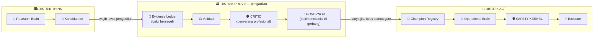

# ARE-0 DIJELASKAN — Buku Panduan untuk Manusia

> **Dokumen non-normatif / zero authority.** Versi resmi ada di 135 blob
> normatif gen-38 (`Manifest V38`, root `3affbbf0…`). File ini adalah
> penerjemahannya ke bahasa manusia: cerita, analogi, dan gambar.
> Ditulis setelah gelombang ditutup: **ARE-0 FORMAL DESIGN CLOSED @03aec99**.

---

## PROLOG — Kisah Gagal yang Melahirkan Semua Ini

Dulu ada bot trading emas bernama AHFMES. Ia punya satu ide sederhana:

> *"Kalau posisi sudah untung $1, kunci di sekitar break-even saja."*

Eksperimen disebut **PPR W1-G1**. Hasilnya? **GAGAL.** Secara sah, jujur,
terverifikasi: tidak robust.

Di titik ini dua jalan terbuka:

```text
JALAN A : "Ya sudah, kita tweak dikit — G1.1, G2, coba indikator lain."
JALAN B : "Tunggu. Kenapa gagalnya menarik? Bisakah kita membangun MESIN
          yang mampu menjawab pertanyaan seperti ini sendiri — secara JUJUR?"
```

Yang dipilih adalah Jalan B. Dan dari pilihan itu lahirlah sadar bahwa masalah
sebenarnya jauh lebih dalam:

> **Sistem yang belajar otomatis, tanpa pagar, akan menjadi mesin p-hacking
> super cepat.** Ia akan menemukan seribu "edge palsu" yang tampak meyakinkan
> — dan menghancurkan modal dengan percaya diri.

Maka ARE-0 dirancang bukan sebagai bot, melainkan sebagai **konstitusi**: 
hukum yang membuat sistem *tidak mungkin* menipu dirinya sendiri.

---

## BAB 1 — SATU KALIMAT YANG MENGATUR SEGALANYA

Seluruh desain ribuan baris ini bisa diringkas jadi satu:

> ### *"Pikiran bebas. Bukti sempit. Modal terkunci."*

| | Seberapa bebas | Contoh |
|---|---|---|
| **Berpikir** | 🟢 Luar biasa bebas — boleh menduga apa pun: news, H4, DXY, model AI aneh | "Bagaimana kalau pola X sebelum news N memprediksi reversal?" |
| **Menyatakan TERBUKTI** | 🔴 Sangat sempit — hanya lewat gerbang bukti yang tersegel | Harus lolos kontrak beku, validasi independen, critic, governor |
| **Menyentuh MODAL** | ⛔ Terkunci brankas — butuh rantai otoritas kriptografis | Bahkan setelah "lolos", masih ada gerbang aktivasi terpisah |

Kenapa begitu paranoid? Karena pasar adalah mesin kasino yang membayar
orang yang curang. Sistem yang boleh menyatakan sendiri "aku valid" akan —
dijamin — menyatakan diri valid saat sedang rugi.

---

## BAB 2 — TIGA DUNIA: KOTA BERTEMBOK

Bayangkan ARE sebagai kota dengan tiga distrik dan satu aturan lalu lintas:



Aturan lalu lintasnya cuma satu:

> **THINK → PROVE → ACT.** Tidak ada pintu belakang. Tidak ada lorong rahasia.
> Bahkan jalur "darurat" pun hanya boleh *mengurangi risiko*, tak pernah menambah.

Dan pemisahan ini bukan sekadar nama class berbeda — ia diegaskan lewat
**trust domain** yang saling tidak percaya: siapa pun yang membuat kandidat
*dilarang* menjadi yang memvalidasi, mengkritik, menghakimi, atau mempromosikannya.

---

## BAB 3 — PARA TOKOH

### 🧠 Research Brain — "Sang Perayap"
Boleh berhayat sebebas-bebasnya. Tidak boleh percaya dirinya sendiri.
Ia adalah penjelajah; semua temuannya hanyalah *dugaan* sampai pengadilan berkata lain.

### 🕵️ Critic — "Jaksa Penuntut Profesional"
Satu-satunya tugasnya MENYERANG. Ia dilarang keras memperbaiki, retune,
memilih subgroup penyelamat, atau mengubah metrik. Repertoarnya cuma tiga:
`serang`, `batalkan integritasnya`, atau `terima klaim versi terbatas`.

### 🤖 Governor — "Hakim Robot"
Menghakimi satu paket bukti beku terhadap satu spesifikasi gerbang beku.
15 gerbang deterministik: otoritas → identitas → ledger → budget → statistik →
stabilitas → ekor risiko → OOD → biaya → safety → freshness champion.
Keputusannya salah satu dari: `INVALID · REJECT · NO_PROMOTION · PROMOTION_ELIGIBLE`.
Ia tak bisa "kreatif". Itu justru fiturnya.

### 🛡️ Capital Safety Kernel — "Penjaga Brankas"
Berdiri DI LUAR jangkauan semua tokoh di atas. Kill switch, emergency flat,
batas exposure. Asimetri sucinya:

> *Boleh mengurangi risiko tanpa izin siapa pun. Tak pernah, dalam kondisi apa pun,
> boleh menambah.*

---

## BAB 4 — SIKLUS HIDUP SATU IDE (kisah lengkap)

Ikuti sebuah ide dari lahir sampai diadili:

```text
🧠 "Bagaimana kalau pola volatilitas H1 sebelum breakout memprediksi arah?"
        │  ← lahir di Distrik THINK. Status: sekadar DUGAAN.
        ▼
📋 RESEARCH CONTRACT dibekukan SEBELUM eksperimen:
   populasi apa, metrik utama apa, budget 20 trial, stopping rule, larangan data
        │  ← mulai detik ini, mengubah aturan = dosa konstitusi
        ▼
🔍 SEARCH TREE tumbuh... trial 1..20 terekam SEMUA (yang gagal pun dicatat!)
        ↓ budget habis tanpa juara
📉 Episode ditutup: NO_STABLE_EDGE — dan itu adalah jawaban ilmiah yang SAH.
   Tidak ada yang perlu "diselamatkan".
```

Versi bahagianya:

```text
🔍 ...trial 17 menghasilkan kandidat menjanjikan
❄️ Kandidat DIBEKUKAN (hash konten dikunci)
📜 Reservasi evidence: snapshot data validasi disegel + dicekal
⚖️ Validasi berjalan buta...
🕵️ Critic menyerang: provenance? leakage? budget? claim terlalu luas?
🤖 Governor menimbang: ΔEV vs champion? tail risk? OOD? biaya eksekusi?
→ NO_PROMOTION  (ide bagus, tapi belum layak menggantikan yang tua)
   ...atau...
→ PROMOTION_ELIGIBLE → 🏦 Champion Registry CAS → 🛡️ Safety preflight
   → 📜 Prospective epoch membuktikan di waktu nyata → baru ACT.
```

Aturan emas sepanjang jalan:

| Keadaan | Yang dilarang |
|---|---|
| Ide gagal | Retune, ganti metrik, pilih subgroup penyelamat |
| Data validasi pernah dilihat | Dipakai lagi sebagai "holdout bersih" |
| Kandidat sudah dibekukan | Diubah sedikitpun (perbaikan = ANAK baru, riwayat tetap) |
| Champion berganti saat proof berjalan | Proof lama dipakai melawan champion baru |
| Ada yang UNKNOWN/tidak yakin | Tetap berjalan seolah aman |

---

## BAB 5 — PERSENJATAAN ANTI-CURANG (7 mekanisme)

### 1. 🧾 Evidence Ledger — "Bukti Bersegel"
Setiap data punya identitas hash. Setiap kali dilihat (bahkan oleh MANUSIA
atau auditor!), event paparan dicatat append-only. Lihat holdout sekali =
independensinya terkonsumsi untuk seluruh keturunan ide tersebut.

### 2. 💰 Program Budget Envelope — "Dompet Keluarga"
Budget tidak per-kontrak, tapi per-KELUARGA ide. Anak kontrak mewarisi utang.
Membuat ID/repo/nama baru tidak mereset apa pun. Habis = berhenti. Sah.

### 3. 🌳 Search Tree Immutable — "Catatan Detektif"
Setiap keputusan outcome-aware jadi node permanen. Optimizer 10.000 evaluasi?
Terhitung 10.000. LLM memunculkan 100 kandidat? Ketahuan 100. Menyembunyikan
= `UNKNOWN_SEARCH_DEBT` = hak pembuktian independen DICABUT.

### 4. 🔗 Non-Forgeability — "Otoritas Anti-Palsu"
`VALIDATED` bukan tulisan bebas — ia kemampuan kriptografis: Governance Root
→ Gate Registry → Role Manifest → VAR single-use → verify-at-use → CAS atomik.
Stale = deny. Unknown = deny. Selalu fail-closed.

### 5. 📊 Comparative Promotion — "Lawan Juara, Bukan Lawan Nol"
Kandidat harus membuktikan **ΔEV vs champion** — cost-adjusted, paired,
plus uji stabil/konsentrasi/ekor/OOD/biaya. Profit solo itu belum apa-apa.
Frekuensi tinggi tak bisa menebus edge yang lemah.

### 6. ❄️ Frozen Shadow — "Ujian Buta di Dunia Nyata"
Shadow window: kandidat beku, tak boleh belajar dari hasilnya sendiri.
Belajar = wajib ganti identitas jadi descendant. Dan evidence prospektif
dibedakan tegas: STRICT_BLIND vs LIVE_FROZEN — overclaim dilarang.

### 7. 🧬 Research Episodes — "Riwayat Tak Tertulis-Ulang"
Problem tidak menyimpan satu status mutable; ia menyimpan RANGKAIAN episode
immutable. Gagal kemarin tidak bisa disembunyikan oleh sukses hari ini.

---

## BAB 6 — KOTA DENGAN KONSTITUSI BERTINGKAT

Semua aturan di atas hidup di **135 dokumen normatif** yang diikat secara
kriptografis menjadi SATU angka:

```text
ROOT = 3affbbf079cef439879c64169938ef8798828097d1143f45ced8947b7f2bc4e2
```

Ganti SATU huruf di SATU dokumen → root berubah → ketahuan. Dokumen di luar
daftar = karantina total (zero authority). Resolver gagal-closed pada ambiguitas
sekecil apa pun. Inilah alasan sistem ini *tidak bisa diam-diam dilonggarkan*.

Dan konstitusi ini **diuji hidupnya** lewat perjalanan brutal:

```text
3× audit eksternal CHANGES_REQUIRED  → koreksi besar-besaran
Serangan internal: Council SA-01..SA-12, impact attack, 365+ skenario regresi,
dua clean pass berturut-turut, re-mint berkali-kali karena label pun diadili…
sampai akhirnya:
ACCEPT_ARE0_FORMAL_DESIGN_CLOSED @03aec99 ✅
```

Pelajaran eposnya: **sistem yang benar bukan yang tak pernah gagal audit —
tetapi yang setiap kegagalan membuatnya lebih kuat dan lebih jujur.**

---

## BAB 7 — ROADMAP: DARI KONSTITUSI KE KEHIDUPAN

```text
✅ ARE-0  CONSTITUTION        (SELESAI @03aec99)
│         Hukum tertulis + mesin kualifikasinya. Nol kode. Memang begitu.
│
▶️ ARE-1  SCIENTIFIC KERNEL   ← BERIKUTNYA (menunggu charter owner)
│         Konstitusi menjadi KODE:
│         • Registry: Problem/Episode/Hypothesis/Contract/Candidate/Capability
│         • Evidence Ledger: snapshot, reservasi, exposure
│         • Mesin kanonikal: hashing, event store CAS, fail-closed G01–G25
│
□    ARE-2  EXPERIENCE INTELLIGENCE
│         Ingatan kaya: regret, counterfactual quality, deteksi anomali
│
□    ARE-3  AUTONOMOUS SCIENCE
│         Research Brain hidup: prioritisasi, bounded search, capability-gap
│
□    ARE-4  GOVERNED EVOLUTION
          Challenger policy/model/kode via sandbox + shadow +
          promote/rollback deterministik — modal akhirnya tersentuh,
          tetap di belakang Safety Kernel.
```

---

## BAB 8 — GLOSARIUM 60 DETIK

| Istilah | Artinya dalam bahasa manusia |
|---|---|
| Problem / Episode | Fenomena yang diteliti / satu investigasi bounded (immutable) |
| Research Contract | "Perjanjian pra-nikah" eksperimen: aturan dibekukan sebelum cari data |
| Candidate | Ide yang sudah dibekukan identitasnya, menunggu diadili |
| Holdout consumption | Data validasi itu seperti film: sekali di-spoiler, tak bisa jadi spoiler lagi |
| Descendant | Anak ide: perbaikan boleh, tapi wajib identitas baru & mewarisi utang |
| Critic | Jaksa yang dilarang menjadi arsitek |
| Governor | Hakim robot 15 gerbang; tak kenal belas kasihan |
| ΔEV vs champion | "Apakah mengganti yang lama dengan kamu bikin untung lebih besar?" |
| IC-1..IC-6 | Enam penguatan hasil serangan brutal terakhir (jangkar root, gated recognition, dll.) |
| Fail-closed | Kalau ragu: JANGAN. Ignorance is a valid state. |

---

## PENUTUP — Untuk Apa Semua Ini?

> Sistem ini bukan bot yang cepat kaya.
> Ia adalah **laboratorium yang sengaja dibuat lambat agar benar** —

yang boleh memimpikan apa pun, tapi hanya boleh *tahu* apa yang buktinya katakan,
dan hanya boleh *menyentuh modal* lewat pintu yang tersegel, teraudit, dan
siap dibolak-balikkan.

P001 menunggu. ARE-1 menunggu charter.
Dan konstitusinya sudah terbukti satu hal penting:

**Ia bisa dilewati ratusan serangan tanpa melonggarkan satu pun pagarnya.**

---

*Dokumen orientasi manusia v1.0 · non-normatif · zero authority ·
sumber resmi: Manifest V38 @ subject ae98b77 / candidate 03aec99 (gen-38, CLOSED)*
