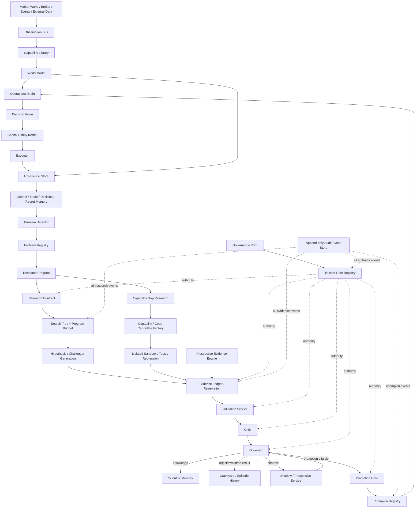
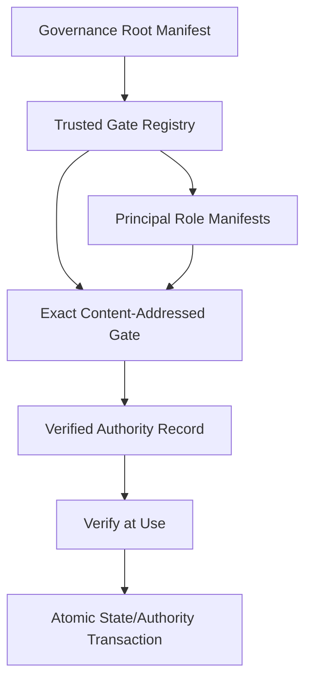

# AHFMES Autonomous Research Engine — Formal Architecture Master V2

Status: **NORMATIVE FORMAL ARCHITECTURE DRAFT / INTERNAL THREE-ROLE ADVERSARIAL PASS / EXTERNAL AUDIT REQUIRED / NO IMPLEMENTATION AUTHORITY**  
Effective date: **2026-08-20**

This is the current integrated human-readable map for ARE formalization.

Normative companion documents:

```text
ARE-0A V3 — State Machines / Research Episodes / Invariants
ARE-0B V3 — Authority / Separation of Duty / Root of Trust
ARE-0C V2 — Evidence Ledger / Holdout / Prospective Evidence
ARE-0D V2 — Program Budget / Search Genealogy / Multiplicity
ARE-0E V2 — Critic / Governor / Promotion / Rollback
ARE-0F V1 — Internal Three-Role Adversarial Review
```

Earlier V0/V1 documents remain historical design evidence when they conflict with these normative drafts.

This package still does NOT authorize source implementation, P001 substantive research, W2/W3, production, AHFMES-NEW modification, or PR merge.

---

# 1. Project identity

AHFMES is being redesigned as an autonomous scientific market-intelligence system whose operational behavior can evolve without making its scientific constitution or capital-safety boundaries self-editable.

Long-term target:

```text
observe market/world
-> store experience
-> detect economically meaningful problems
-> create bounded Research Programs
-> form hypotheses
-> search within a finite family budget
-> preserve complete genealogy
-> protect independent evidence
-> validate frozen candidates
-> attack claims through independent Critic
-> adjudicate through mechanical Governor
-> learn knowledge/rejection/no-result
-> shadow eligible challengers
-> promote only exact proven descendants
-> rollback safely
-> repeat with new evidence
```

---

# 2. Fundamental authority law

```text
THINK -> PROVE -> ACT
```

Never:

```text
THINK -> ACT
```

No research-owned object, model, code candidate, LLM output, candidate status field, or human-readable report can create capital authority.

---

# 3. What may evolve

Open research space:

```text
timeframe/context horizon
indicators/features
market representations
policy composition
model class
model weights
state classifier
news/event data
intermarket data
microstructure representations
capabilities
sensors
code modules
```

Evolution must remain compatible with micro-execution economic identity unless a separate project re-charters the system.

---

# 4. What is constitutional

```text
Scientific Constitution
Capital Safety Kernel
Authority separation
Audit/provenance requirements
Fail-closed semantics
Micro-execution orientation
```

`HIGH OPPORTUNITY DENSITY` remains a preference conditional on evidence, not a trade quota.

---

# 5. Architecture layers



---

# 6. Trust worlds

```text
WORLD 1 THINK
  Research Brain
  Problem prioritization
  Search/candidate generation
  Capability-gap research

WORLD 2 PROVE
  Contract Gate
  Evidence Ledger
  Validation Service
  Critic
  Governor
  Promotion Gate

WORLD 3 ACT
  Champion Registry
  Operational Brain
  Capital Safety
  Executor
```

Trust-domain separation is mechanical authority separation, not just different class names.

---

# 7. Fast loop

```text
input arrives
-> as-of normalize
-> update world state
-> retrieve relevant memory/model
-> compute bounded decision value
-> select action
-> Capital Safety
-> execute / abstain
-> record exact experience
```

Fast loop adapts current state estimates. It does not self-edit structural production policy in place.

---

# 8. Slow loop

```text
experience
-> regret/anomaly/problem
-> immutable Research Episode
-> Research Program + Program Budget Envelope
-> locked Research Contract
-> bounded discovery
-> Search Tree
-> frozen challenger
-> Evidence Reservation
-> validation
-> Critic
-> Governor
-> knowledge/reject/no-result/shadow
-> promotion eligibility
-> exact champion comparison
-> atomic promotion
```

---

# 9. Problem and Research Episode

Persistent Problem identity does NOT hold one mutable terminal result.

```text
Problem P001
├─ Research Episode E1 = REJECTED
├─ Research Episode E2 = NO_STABLE_EDGE
└─ Research Episode E3 = VALIDATED_BOUNDED
```

Every episode disposition is immutable.

Current-understanding summaries are derived views, never authority.

---

# 10. Research Program

A Research Program groups a causally related bounded search family.

It freezes a family-level Program Budget Envelope before outcome-driven search expands.

```text
Program Budget
    ↓ allocates
Contract Budget 1
Contract Budget 2 descendant
Contract Budget 3 descendant
```

Descendants consume the same family envelope.

Research cannot create infinite fresh contracts until a PASS appears.

---

# 11. Research Contract

Locks before verdict-bearing validation:

```text
question
Research Episode
claim/research family
information available at decision
primary population
primary estimand
allowed search space
Program/Contract budget
validation family
multiplicity/error-control plan
stopping rule
Evidence roles
Critic/Governor roles
PromotionGateSpec timing
prohibited information
```

After LOCKED, material edits require descendant and inherited debt.

---

# 12. Search Tree and debt

Every adaptive search decision is an immutable node.

Tracks:

```text
problem reformulation
hypothesis family
feature invention/selection/interaction
threshold/hyperparameter
model family/architecture
population/subgroup
horizon
metric/loss
candidate birth/descendant
capability gap/addition
validation batch/query
shadow descendant
```

Optimizer/LLM calls do not hide child evaluations.

Unknown hidden search debt blocks independent scientific authority.

---

# 13. Evidence Ledger

Evidence independence is relational:

```text
INDEPENDENT_FOR(
  snapshot,
  claim family,
  research family,
  Research Program,
  role,
  ledger revision
)
```

It is NOT `dataset.validation=true`.

Exposure events include automated agents and humans/auditors whose observed results can influence later research.

---

# 14. Holdout exhaustion

No arbitrary universal “N uses”.

Once outcome-aware evidence is exposed to a research/claim family:

```text
related adaptive descendants cannot call the same evidence untouched independent confirmation
```

The evidence may remain discovery/diagnostic data.

New prospective evidence is the sustainable long-term source of confirmation.

---

# 15. Prospective evidence classes

```text
PROSPECTIVE_STRICT_BLIND
PROSPECTIVE_LIVE_FROZEN
SHADOW_LIVE
```

Strict blind requires meaningful isolation of outcome-bearing evidence from adapting research principals.

Live-frozen means candidate/stopping rules are frozen but Research may see enough public market path to reduce blinding strength.

The system must state the actual class rather than overclaim independence.

---

# 16. Validation reservation

Before evidence is opened:

```text
exact evidence snapshot
exact candidate batch
exact Research Program/Contract
exact claim family
exact metrics/populations
exact multiplicity plan
exact permitted disclosures
exact ledger revision
```

are atomically reserved.

Result-driven candidate insertion into the batch is prohibited.

---

# 17. Scientific state

No single giant status enum.

Orthogonal:

```text
identity
lifecycle
scientific disposition
integrity
epistemic status
retention
```

Evidence adds provenance/exposure/relational eligibility.

Archival does not erase rejection/invalidity/exposure/debt.

---

# 18. Authority root



Research cannot modify Governance Root, Gate Registry, or its own Role Manifest.

---

# 19. Authority freshness

Proof/transition authority binds exact:

```text
subject root
state revision
previous event hash
contract root
Evidence Ledger snapshot/revision
Search Tree/debt revision
Program Budget root
constitution/governance root
candidate genealogy
validation family
```

Promotion additionally binds:

```text
current champion
champion registry generation
deployment context
Capital Safety
execution contract
rollback target
```

Stale => deny.

---

# 20. Canonical content identity

Proof objects use:

```text
canonical encoding
scientific decimal strings
content-addressed artifacts
domain-separated SHA-256
transitive dependency closure
```

Mutable aliases such as `current.pkl` cannot sit behind a frozen candidate authority.

---

# 21. Concurrency

All authority-sensitive event streams:

```text
expected revision
previous-event hash
atomic compare-and-append
```

Champion Registry:

```text
compare-and-swap current champion + generation
```

No last-writer-wins scientific authority.

---

# 22. Critic

Critic can attack/invalidate/limit.

Critic cannot repair.

```text
failed candidate remains failed
new idea -> Research Lead / descendant
```

Critic result exposure also enters Evidence Ledger if it can motivate future research.

---

# 23. Governor

Mechanical gate order:

```text
Governance roots
identity
contract
Evidence Ledger
Program/Search budget
validation integrity
incremental champion-relative economics
uncertainty
stability/support/concentration
tail risk
OOD
execution feasibility/cost
shadow/prospective proof
Critic
Capital Safety
champion freshness
```

Outcomes:

```text
INVALID
REJECT
NO_PROMOTION
PROMOTION_ELIGIBLE
ROLLBACK_REQUIRED
```

---

# 24. Comparative promotion

```text
challenger profitable
!= challenger better than champion
```

Where opportunity sets differ, proof may require both:

```text
common-opportunity paired effect
whole-policy eligible-stream effect
```

The hierarchy is frozen before outcomes.

---

# 25. Champion drift during proof

Candidate C may be evaluated versus Champion A.

If A is replaced by B before C promotion:

```text
C-vs-A evidence remains scientific history
C cannot automatically replace B
```

Fresh comparison/compatibility authority is required.

Multiple challenger promotion authorities against A become stale after first registry change.

---

# 26. Capital activation

```text
PROMOTION_ELIGIBLE
-> A-PROMOTE
-> Champion Registry update
!= broker/capital activation
```

Capital activation remains separate TD-CAPITAL-SAFETY authority.

Emergency flat can reduce risk without inventing scientific edge.

---

# 27. Memory architecture

```text
Market Memory
Trade Memory
Decision Memory
Regret Memory
Problem Memory
Research Episode History
Scientific Memory
Graveyard
Evidence Ledger
Search Genealogy
Champion History
```

The system remembers failures and why they failed.

---

# 28. Capability evolution

Levels:

```text
L0 Knowledge
L1 Policy
L2 Model
L3 Capability / Code
```

A hard problem may end as:

```text
CURRENTLY_NON_PREDICTABLE
INSUFFICIENT_SAMPLE
NO_STABLE_EDGE
```

not automatically `add news/H1/DXY`.

Capability gap itself requires evidence and Program Budget.

---

# 29. Policy Intermediate Representation direction

Many strategy changes should be representable as policy/model artifacts rather than source rewrites.

Future policy IR may include bounded:

```text
observables
state predicates
logical composition
decision-value queries
uncertainty/support gates
actions
```

Policy IR is not unrestricted code execution.

Novel primitives require L3 capability/code candidate.

---

# 30. Code evolution

```text
proven capability gap
-> code candidate
-> isolated sandbox
-> static/security checks
-> unit tests
-> regression/replay
-> scientific validation
-> prospective/shadow proof
-> Critic
-> Governor
-> promotion
-> separate capital activation
```

Active champion is immutable. Self-evolution creates descendants, not in-place brain surgery.

---

# 31. Sandbox

Future code candidate sandbox must isolate:

```text
production credentials
broker mutation
filesystem scope
network scope
process/resource limits
artifact outputs
```

Exact sandbox technology is future implementation work.

---

# 32. Rollback

Before activation:

```text
rollback target
compatibility proof
state/memory compatibility
telemetry continuity
trigger classes
registry generation
```

Rollback is append-only champion history, never erased history.

---

# 33. P001 seed test

```text
P001 = PROFIT GIVEBACK
known failed hypothesis = simple +1 -> break-even protection
verdict = PPR_W1_G1_REJECT
answer = UNKNOWN
```

Formalization must NOT invent G2/G1.1 or another exit rule.

Future ARE should be judged on whether it can research P001 lawfully—even if the correct result is `NO_EDGE_FOUND`.

---

# 34. News and higher timeframe freedom

Future ARE may research:

```text
M5/M15/H1/H4
news/events
DXY/yields
other contextual data
```

but all information must have as-of provenance and must improve micro decision value under evidence.

Information timeframe != holding timeframe.

---

# 35. Fail-closed philosophy

```text
unknown relation -> RELATED
unknown evidence freshness -> validation denied
unknown hidden search -> independent claim denied
unknown material cost -> no promotion
unknown OOD behavior -> no promotion/domain restriction
stale champion -> promotion denied
partial authority transaction -> no state advance
```

Ignorance is a valid state.

---

# 36. Internal adversarial pass

Three functional passes were applied:

```text
Architect
Red-Team
Scientific Governor
```

External first-round blockers were corrected.

Internal Red-Team found additional:

```text
Problem disposition overwrite risk
insufficient separation-of-duty matrix
contract-level budget expansion/reset risk
prospective "blind" overclaim risk
champion drift during proof
```

Normative drafts were updated before this Master V2 publication.

---

# 37. Bounded residuals for external attack

```text
claim-family unrelatedness proof semantics
search instrumentation completeness under arbitrary flexible tools
concrete cryptographic/process trust realization
strict prospective isolation on a single physical machine
transaction/recovery storage implementation
future contract-specific numerical statistical/economic gates
```

These are visible residuals, not silent assumptions.

---

# 38. Formal reading order for external auditor

```text
1. AHFMES_ARE_FORMAL_ARCHITECTURE_MASTER_V2.md
2. AHFMES_ARE_0A_STATE_MACHINES_AND_INVARIANTS_V3.md
3. AHFMES_ARE_0B_AUTHORITY_NON_FORGEABILITY_V3.md
4. AHFMES_ARE_0C_EVIDENCE_LEDGER_AND_HOLDOUT_CONSUMPTION_V2.md
5. AHFMES_ARE_0D_SEARCH_GENEALOGY_BUDGET_MULTIPLICITY_V2.md
6. AHFMES_ARE_0E_CRITIC_GOVERNOR_PROMOTION_V2.md
7. AHFMES_ARE_0F_INTERNAL_THREE_ROLE_ADVERSARIAL_REVIEW_V1.md
8. CURRENT_AUTHORITY_INDEX.md
```

---

# 39. Current authority boundary

```text
ARE FORMALIZATION = ACTIVE
ARE-0 CLOSED      = NO
IMPLEMENTATION    = NOT AUTHORIZED
P001 RESEARCH     = CLOSED
G1 RETUNE         = PROHIBITED
G2                = NOT AUTHORIZED
W2/W3             = CLOSED
TRAINING/OOS      = CLOSED
PRODUCTION        = CLOSED
AHFMES-NEW        = CLOSED
PR #20 MERGE      = NOT AUTHORIZED
```

---

# 40. Current disposition

```text
ARE FORMAL ARCHITECTURE MASTER V2
= NORMATIVE DRAFT
= INTERNAL THREE-ROLE ADVERSARIAL PASS
= READY FOR EXTERNAL ADVERSARIAL AUDIT
= NOT CLOSED
= NOT IMPLEMENTATION AUTHORITY
```
