# AHFMES Autonomous Research Engine V0 — Human Flowcharts

Status: **HUMAN-READABLE ARCHITECTURE MAP / NOT IMPLEMENTATION AUTHORITY**  
Effective date: **2026-08-20**

This file exists so a human reviewer, future assistant, or engineering agent can reconstruct the intended direction without relying on chat history.

## 1. System-level flow: THINK → PROVE → ACT

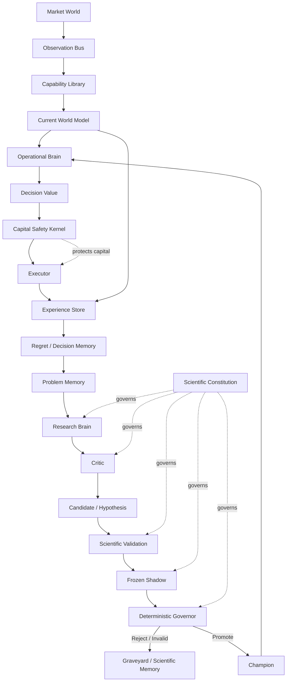

Interpretation:

- Research can think broadly.
- Research cannot jump directly to execution.
- Evidence must pass through proof machinery.
- Capital always remains behind a separate safety boundary.

## 2. Three-world authority separation

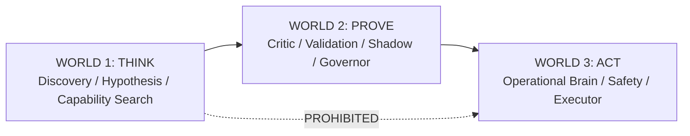

## 3. Problem lifecycle

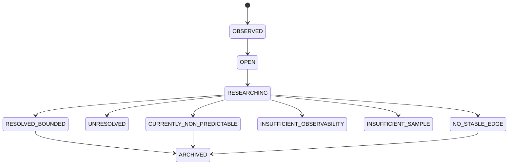

Important: not every problem must end with a strategy.

## 4. Claim / epistemic lifecycle

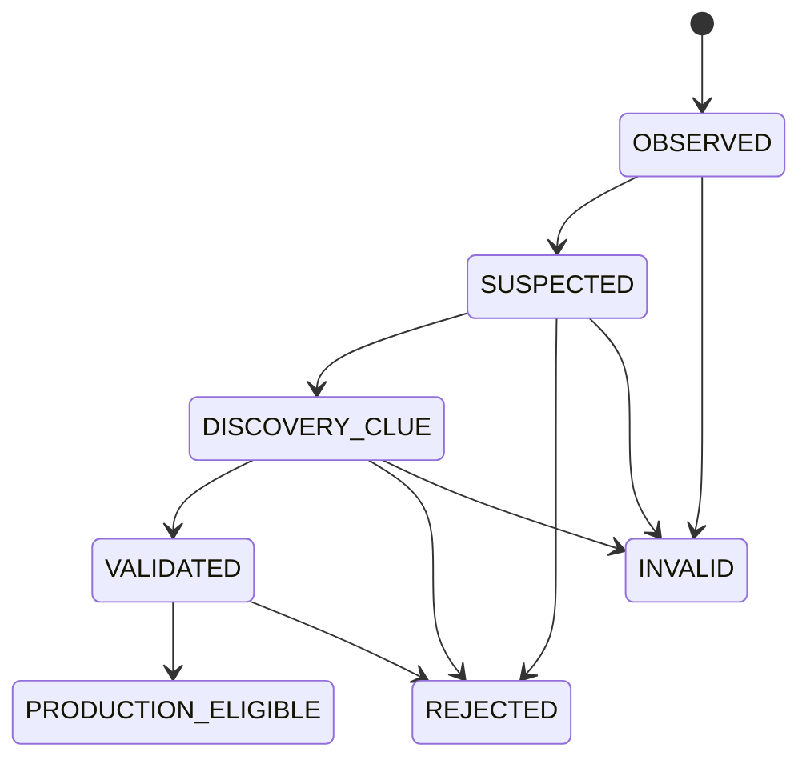

`REJECTED` = valid experiment, hypothesis failed.  
`INVALID` = evidence/contract integrity failed; scientific result cannot be used.

## 5. Research Contract lifecycle

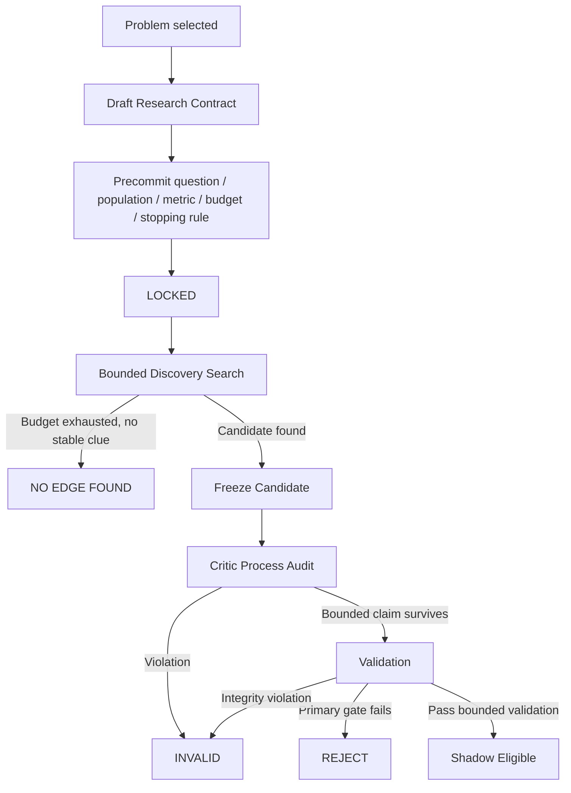

No threshold/metric/population rescue is allowed inside the same locked contract.

## 6. Full search-tree accounting

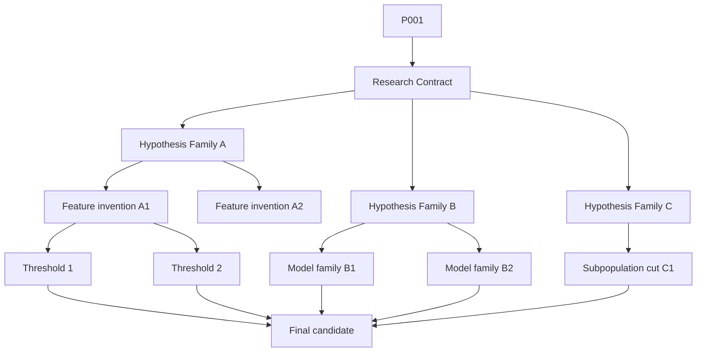

The candidate's multiplicity burden comes from the entire path/search family, not just the final test.

## 7. Evidence Ledger and holdout consumption

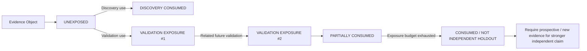

The exact statistical rule for consumption is future design work; the architectural fact that exposure is finite is mandatory.

## 8. Critic boundary

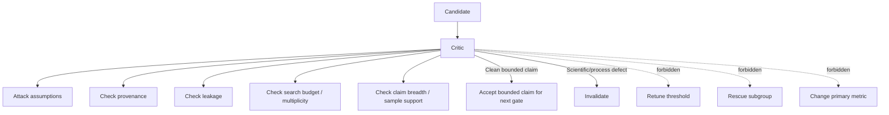

## 9. Frozen Shadow lifecycle

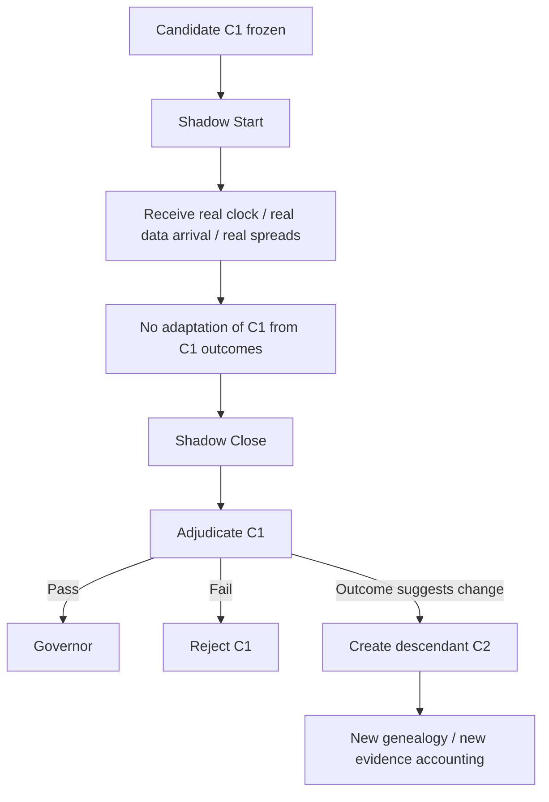

## 10. Capability-gap decision flow

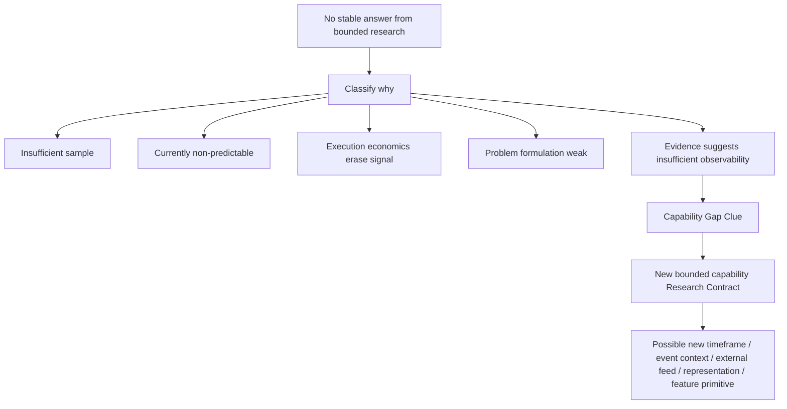

Failure does not automatically mean "add more features".

## 11. Evolution hierarchy

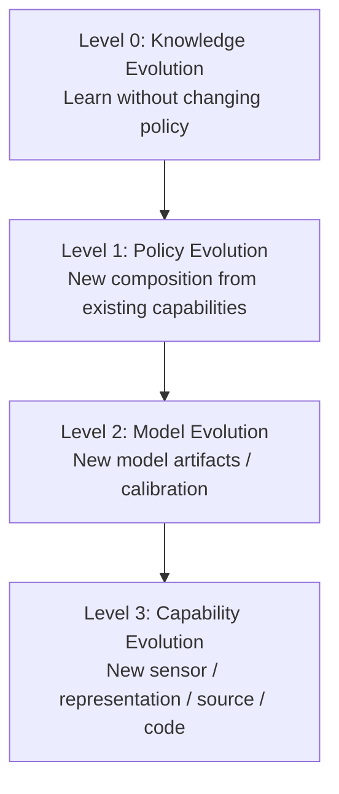

This is not a mandatory linear progression for every idea. It expresses increasing mutation depth and proof burden.

## 12. Code evolution / descendant model

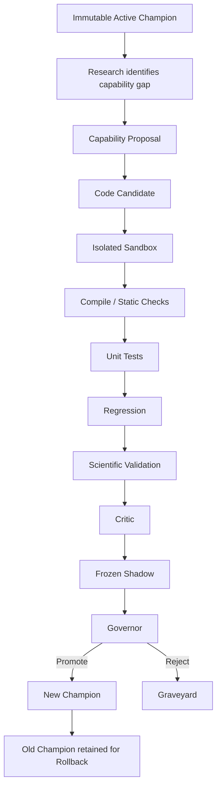

The active system never edits itself in-place and immediately trades the mutation.

## 13. Fast loop vs slow loop

```mermaid
flowchart LR
    subgraph FAST[Fast Loop — Market Intelligence]
      T[Tick / incoming data] --> ST[State estimate]
      ST --> MR[Memory retrieval]
      MR --> DV[Decision value]
      DV --> SAFE[Capital safety]
      SAFE --> EX[Execute / Abstain]
    end

    subgraph SLOW[Slow Loop — Scientific Evolution]
      EXP[Experience] --> PROB[Problem detection]
      PROB --> RES[Research Contract]
      RES --> DISC[Bounded discovery]
      DISC --> CRIT[Critic]
      CRIT --> VAL[Validation]
      VAL --> SHAD[Shadow]
      SHAD --> PROM[Promotion / Reject]
    end

    EX --> EXP
    PROM --> MR
```

Fast loop adapts to current state. Slow loop changes knowledge/policy/capability only after proof.

## 14. Seed problem P001 flow

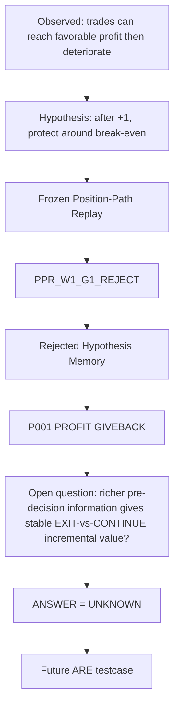

This flow intentionally stops at `UNKNOWN`. No G1.1/G2/manual indicator rescue is part of the current direction.

## 15. Development sequence

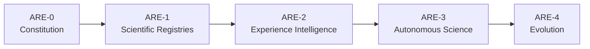

Do not start autonomous code generation before the constitutional and registry layers exist and have been audited.

## 16. Human checklist before future ARE implementation

A reviewer should be able to answer YES to all of these before implementation authority is granted:

- Is THINK separated from ACT by a PROVE layer?
- Is Scientific Constitution independent from Capital Safety?
- Is evidence exposure/holdout consumption represented?
- Is the full search genealogy represented?
- Can `NO RESULT` and `CURRENTLY_NON_PREDICTABLE` be final outcomes?
- Can Critic invalidate without retuning?
- Is Governor mostly mechanical/deterministic?
- Does shadow freeze the candidate for the window?
- Does a shadow-derived change create a descendant?
- Is information-time represented for every observable class?
- Can a capability gap be rejected instead of automatically adding features?
- Can code evolve only through isolated descendants?
- Is rollback retained?
- Is P001 preserved without manual answer injection?

If any answer is NO, the architecture is not ready for autonomous implementation.