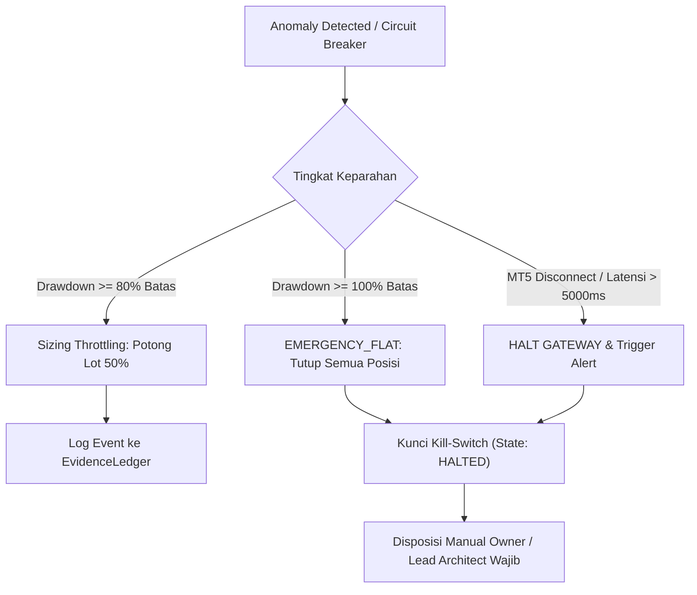

# 🚀 PHASE 5 READINESS MANIFESTO: THE UNIFIED FLIGHT MANUAL

```text
DOKUMEN OTORITAS : PROJECT_GOVERNANCE/COGNITIVE_ROADMAP/PHASE_5_READINESS_MANIFESTO.md
STATUS           : RATIFIED & ACTIVE GATEKEEPING 🔴
LEVEL KEAMANAN   : DEFCON-1 (PRE-FLIGHT LIVE/PAPER TRADING VERIFICATION)
BASELINE KODE    : 61f54c9 on main (400 tests pass, 100% Green)
DISPOSISI        : PRODUCTION = CLOSED | GATEKEEPING_ACTIVE
```

---

## 🧭 I. Ringkasan Eksekutif

Dengan selesainya **Fase 4 (Statistical Rigor, Evidence RAG, Vault Disaster Recovery, Crisis Replay, WFA, dan Portfolio Correlation Gate)** dengan 400 pengujian otomatis yang lulus 100%, sistem kuantitatif **AHFMES-ARE** telah mencapai batas kematangan *Hardened Sandbox*.

Seluruh 7 Organ Komputasional telah terpasang, teruji secara matematis dan terisolasi:
1. **🧠 Organ 1 (Otak / Kognisi):** Alpha Generation & Search Tree.
2. **🛡️ Organ 2 (Sistem Kekebalan):** Governor, Critic, CSK, Statistical Rigor & Portfolio Correlation Gate.
3. **👁️👂 Organ 3 (Indra / Input):** DataPurifier, LOCF Micro-gap Alignment & Toxic Spread Neutralization.
4. **💪 Organ 4 (Otot / Eksekusi):** MT5 Gateway & Live Demo Runner (Zero-LLM Rule).
5. **🗄️ Organ 5 (Memori & DNA):** The Windows Vault Protocol (Dual-Layer Witness + Replicator DR).
6. **🗣️ Organ 6 (Pusat Bahasa / Antarmuka):** Web Control Center, Evidence RAG Copilot & Post-Trade Diagnostics.
7. **🌐 Organ 7 (Pencernaan Eksternal):** Multi-modal Scraper, Seed Extractor & Historical Crisis Seeder.

Namun, mengalihkan modal riil atau demo aktif ke pasar MetaTrader 5 tanpa verifikasi infrastruktur non-stop adalah pelanggaran fatal terhadap etika rekayasa kuantitatif. **Fase 5 (Live Operational Readiness)** digembok rapat (*Fail-Closed*) di balik **7 Iron Pre-Flight Checkpoints**.

---

## 🔒 II. The 7 Iron Pre-Flight Checkpoints

Setiap butir di bawah ini adalah prasyarat mutlak. **Wajib 7/7 Centang Hijau** sebelum status `PRODUCTION` dapat dibuka oleh Lead Architect.

```text
[ ] CHECKPOINT 1: Dynamic Account Balance & Drawdown Binding
[ ] CHECKPOINT 2: 7x24 Jam Non-Stop Stability Run (RES-COG-03 / DELEGASI_024)
[ ] CHECKPOINT 3: Windows Vault Dual-Layer Verification & Replicator Test
[ ] CHECKPOINT 4: Black Swan Crisis Survival Certificate (2008, 2015, 2020)
[ ] CHECKPOINT 5: Institutional Statistical Rigor & Portfolio Independence
[ ] CHECKPOINT 6: Emergency Alerting CCTV Heartbeat (Telegram / Webhook / SMTP)
[ ] CHECKPOINT 7: SEC 15c3-5 Pre-Trade Risk Collar (CSK Hard Veto)
```

### 1. [ ] Dynamic Account Balance & Drawdown Binding
- **Kondisi Saat Ini:** File `are/mt5_runner.py:64` masih menggunakan stub evaluasi statis `current_drawdown = 0.01`.
- **Mandat Fase 5:** Wajib mengikat pembacaan `current_drawdown` ke polling live equity terminal MT5 (`account_info().equity` vs `account_info().balance`).
- **Kriteria Lolos:** Drawdown diperbarui secara sub-detik dan memicu *refleks pemotongan lot 50%* pada drawdown 80% batas, serta *emergency flat* saat drawdown menyentuh batas risiko.

### 2. [ ] 7x24 Jam Non-Stop Stability Run (RES-COG-03)
- **Kondisi Saat Ini:** Residu `RES-COG-03` (DELEGASI_024 Token Auth Gateway) ditangguhkan menunggu bukti stabilitas lokal.
- **Mandat Fase 5:** Daemon runtime lokal (`MT5LiveDemoRunner` + `SystemHealthMonitor`) wajib berjalan selama **168 jam non-stop** pada mesin Windows host.
- **Kriteria Lolos:** 
  - Zero unhandled crash / exception.
  - Memory leak terpantau $< 5.0\text{ MB/hari}$.
  - Zero status `HealthStatus.CRITICAL`.

### 3. [ ] Windows Vault Dual-Layer Verification & Replicator Test
- **Kondisi Saat Ini:** `VaultReplicator` telah terbukti secara unit test (@386 tests).
- **Mandat Fase 5:** Menjalankan replikasi riil terjadwal di mesin Windows host.
- **Kriteria Lolos:** Minimal 7 siklus backup berurutan sukses tersimpan di folder replikasi lokal/eksternal dengan validasi SHA-256 *read-back* dan hash chain manifest yang utuh tanpa cacat.

### 4. [ ] Black Swan Crisis Survival Certificate
- **Kondisi Saat Ini:** Engine `run_crisis_replay()` terimplementasi di `are/backtest.py`.
- **Mandat Fase 5:** Strategi Champion yang akan dideploy wajib diuji terhadap 3 krisis historis:
  1. *2008 Global Financial Crisis* (-50% market plunge).
  2. *2015 Swiss Franc (EURCHF) Depeg Flash Crash* (-30% FX shock).
  3. *2020 COVID Market Crash* (-35% equity plunge).
- **Kriteria Lolos:** Retensi modal akhir $\ge 50\%$ dan *Max Drawdown* $\le 50\%$ di ketiga skenario.

### 5. [ ] Institutional Statistical Rigor & Portfolio Independence
- **Mandat Fase 5:** Kandidat strategi Champion wajib memenuhi parameter kuantitatif institusional:
  - *Deflated Sharpe Ratio (DSR)*: $p\text{-value} < 0.05$ (anti-data mining luck).
  - *Probabilistic Sharpe Ratio (PSR)*: $\ge 0.95$.
  - *Walk-Forward Analysis (WFA) Efficiency Ratio*: $> 0.50$ pada $\ge 5$ rolling folds.
  - *Portfolio Return Correlation*: $< 0.85$ terhadap seluruh strategi aktif yang berjalan di portfolio.

### 6. [ ] Emergency Alerting CCTV Heartbeat
- **Mandat Fase 5:** Modul `CriticalAlertSender` wajib diuji secara end-to-end dengan webhook Telegram/Slack riil dan SMTP relay.
- **Kriteria Lolos:** Operator menerima heartbeat berkala dan notifikasi seketika ($< 2$ detik) saat status krisis/veto diinjeksikan secara sengaja pada lingkungan staging demo.

### 7. [ ] SEC 15c3-5 Pre-Trade Risk Collar
- **Mandat Fase 5:** Penegakan firewall *CapitalSafetyKernel* (CSK) di depan gateway broker:
  - Lot size clamping otomatis sesuai batas modal akun.
  - Rate limiting maksimal 10 order per menit (anti-spam / flash-order bug).
  - Pemutusan koneksi MT5 langsung memicu `EMERGENCY_FLAT` dan transisi state `HALTED`.

---

## 🚨 III. Protokol Penanganan Insiden (Incident Response Drill)



1. **Drawdown Warning ($80\%$ limit):**
   Sistem secara otomatis memotong ukuran lot berikutnya sebesar $50\%$ untuk mencegah akselerasi kerugian modal.
2. **Hard Threshold Breach ($100\%$ limit):**
   `CapitalSafetyKernel` memicu `EMERGENCY_FLAT`. Seluruh order terbuka ditutup seketika pada harga pasar terbaik dan status eksekusi dikunci menjadi `HALTED`.
3. **Manual Override (Kill Switch):**
   Operator manusia dapat memicu Kill Switch sewaktu-waktu melalui:
   - Web Control Center UI (`/api/action` -> `kill_switch=True`).
   - Copilot Chat Command (*"Aktifkan kill switch sekarang"*).
   - Python CLI Emergency Trigger.

---

## ⚖️ IV. Matriks Go / No-Go Adjudikasi Lead Architect

| Kondisi Sistem | Status Keputusan | Tindakan Operasional |
| :--- | :---: | :--- |
| **Kurang dari 7 Checkpoint Terpenuhi** | 🛑 **NO-GO** | Sistem tetap beroperasi pada mode Sandbox/Demo; live order dilarang. |
| **Terdeteksi Memory Leak / Unstable Host** | 🛑 **NO-GO** | Reset countdown 168 jam; audit kebocoran resource. |
| **Hash Chain Vault Terputus** | 🛑 **NO-GO** | Eksekusi `rebuild_cache_from_witness()` atau restore dari backup. |
| **7/7 Checkpoint Terverifikasi Formal** | 🟢 **GO** | Penerbitan Mandat Fase 5; otorisasi Paper Trading live feed. |

---

> [!CAUTION]
> **PERINGATAN ARSITEKTURAL MUTLAK:**  
> Dilarang menghapus atau mem-bypass dokumen ini. Membuka akses trading riil sebelum 7/7 Checkpoint terpenuhi adalah pelanggaran berat tata kelola rekayasa AHFMES-ARE.